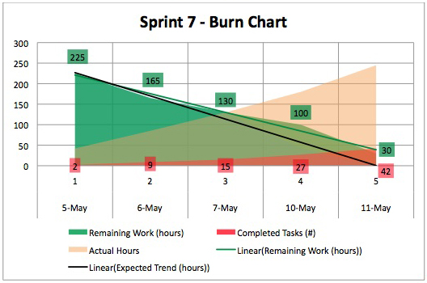

# ⬆️ Scrum Developer I for PSD I Practice Tests Exams Questions & Answers

## Udemy & Etsy

❣️ Please support us by purchasing this course on Udemy in an interactive version with the [discounted link](https://www.udemy.com/course/professional-scrum-developer-i-psd-i-practice-exams/?referralCode=E1E5C69CF22100D112DD). If you're working for a company, you could most probably easily claim this expense during preparation for your exam. For us, it's to be, or not to be, in the game.

🛍️ Alternatively, you can buy the PDF with those questions on [Etsy](https://ditectrev.etsy.com/listing/1343003141).

## ✨ This course is unlike any Scrum Developer I for PSD I course you will find online.

✋ Join a live online community and a course taught by industry experts and pass the Professional Scrum Developer I (PSD I) confidently. We aim to build an ecosystem of Information Technology (IT) certifications and online courses in cooperation with the technology industry. We believe it will give our students 100% confidence in the pacing market in an open-source environment. We are just at the beginning of our way, so it's even better for you to join now!

## ⌛️ Short and to the point; why should you take the course:

1. Always happy to answer your questions on Udemy's Q&A's and outside :)
2. Failed? Please submit a screenshot of your exam result and request a refund (via our upcoming platform, not possible on Udemy); we'll always accept it.
3. Learn about topics, such as:
   - Architecture & Design;
   - Class Coupling;
   - Code Quality;
   - Coding Best Practices;
   - Continuous Delivery (CD);
   - Continuous Deployment (CD);
   - Continuous Integration (CI);
   - Cross-Functional Teams;
   - Cycle Time per Feature;
   - Cyclomatic Complexity;
   - Definition of Done (DoD);
   - Documentation;
   - Don't Repeat Yourself (DRY);
   - Efferent Couplings;
   - Keep It Simple, Stupid (KISS);
   - Mocking;
   - Scrum Framework;
   - Software Architecture;
   - Software Design;
   - SOLID Principles;
   - Spying;
   - Stubbing;
   - Technical Debt;
   - Test Driven Development (TDD);
   - Test First Development (TFD);
   - **Much More!**
4. Questions are similar to the actual exam, without duplications (like in other courses ;-)).
5. The Practice Tests Exams simulate the actual exam's content, timing, and percentage required to pass the exam.
6. This course is **not** a Professional Scrum Developer I (PSD I) Exam Dump. Some people use brain dumps or exam dumps, but that's absurd, which we don't practice.
7. 302 **unique** questions.

## ☝️ Course Updates

**[v1.0.0](../../releases/tag/v1.0.0): November 12, 2021.**

- Launch of the course.

**[v1.0.1](../../releases/tag/v1.0.1): August 24, 2022.**

- Minor improvements since the course launch with a relaunch of the course due to misunderstanding Udemy rules by using unfortunate keywords in the title.

**[v1.0.2](../../releases/tag/v1.0.2): October 10, 2022.**

- Fixing 1 question w/minor improvements.

**[v1.0.3](../../releases/tag/v1.0.3): November 2, 2022.**

- Fix 1 question w/minor improvements.

**[v1.1.0](../../releases/tag/v1.1.0): December 5, 2022.**

- Fix several questions.

**[v1.2.0](../../releases/tag/v1.2.0): January 10, 2023.**

- Fix 6 questions w/a minor typo in incorrect answer.

**[v1.3.0](../../releases/tag/v1.3.0): March 14, 2023.**

- Add 11 new questions w/minor improvements.

**[v1.4.0](../../releases/tag/v1.4.0): April 22, 2023.**

- Add (yet another) 11 new questions, fixes a couple of wrong answers, and minor typos.

**[v1.4.1](../../releases/tag/v1.4.1): July 24, 2023.**

- Fix 3 questions.

**[v1.5.0](../../releases/tag/v1.5.0): November 3, 2023.**

- Add 3 new questions and correct 1 question with a number of valid answers.

**[v1.5.1](../../releases/tag/v1.5.1): February 9, 2024.**

- Improve 2 questions with answer fix and proper title.

## 🙋‍♀️ & 🙋‍♂️ Contribution

We are so thankful for every contribution, which makes sure we can deliver top-notch content. Whenever you find a missing resource, broken link in a [Table of Contents](#table-of-contents), the wrong answer, please submit an [issue](../../issues). Even better would be a [Pull Request (PR)](../../pulls).

## Who this course is for:

- 👨‍🎓 Students preparing for the Professional Scrum Developer I (PSD I) Exam;
- 👨‍🎓 Agile Coaches;
- 👨‍🎓 Agile Leaders;
- 👨‍🎓 DevOps Engineers;
- 👨‍🎓 IT Professionals;
- 👨‍🎓 Lead Engineers;
- 👨‍🎓 Scrum Masters;
- 👨‍🎓 Software Developers/Engineers;
- 👨‍🎓 Software Testers;
- 👨‍🎓 Product Managers;
- 👨‍🎓 Product Owners;
- 👨‍🎓 Project Managers;
- 👨‍🎓 Team Leaders.

## Requirements

- 🤩 Excitement to learn!
- 0️⃣ Prior knowledge is required;
- ✅ You can pass the Professional Scrum Developer I (PSD I) Exam solely based on our Practice Tests Exams.

## Table of Contents

| No. | Questions |
| --- | --------------------------- |
| 1   | [When can Product Backlog Refinement occur?](#when-can-product-backlog-refinement-occur) |
| 2   | [What would NOT be considered Refactoring?](#what-would-not-be-considered-refactoring) |
| 3   | [Your Scrum Team is one of seven teams working on a Software Product. All teams use the same Version Control System. Which is the best approach to deliver a high-quality Increment?](#your-scrum-team-is-one-of-seven-teams-working-on-a-software-product-all-teams-use-the-same-version-control-system-which-is-the-best-approach-to-deliver-a-high-quality-increment) |
| 4   | [Who creates documentation included with an Increment?](#who-creates-documentation-included-with-an-increment) |
| 5   | [What is a merge in a Version Control System?](#what-is-a-merge-in-a-version-control-system) |
| 6   | [Which three of the following are feedback loops in Scrum?](#which-three-of-the-following-are-feedback-loops-in-scrum) |
| 7   | [Which four types of tests can be included in an automated test harness?](#which-four-types-of-tests-can-be-included-in-an-automated-test-harness) |
| 8   | [Which concept is described by the Last Responsible Moment?](#which-concept-is-described-by-the-last-responsible-moment) |
| 9   | [Choose four desirable characteristics of a Unit Test.](#choose-four-desirable-characteristics-of-a-unit-test) |
| 10  | [Why does a test written using TDD (Test Driven Development) initially fail?](#why-does-a-test-written-using-tdd-test-driven-development-initially-fail)   |
| 11  | [When do the Developers show their work to the Product Owner?](#when-do-the-developers-show-their-work-to-the-product-owner)   |
| 12  | [What are possible benefits from practicing Test Driven Development (TDD)?](#what-are-possible-benefits-from-practicing-test-driven-development-tdd)   |
| 13  | [Who decides the System Architecture of a Product developed using Scrum?](#who-decides-the-system-architecture-of-a-product-developed-using-scrum)   |
| 14  | [When using Continuous Integration, how often should the build be executed?](#when-using-continuous-integration-how-often-should-the-build-be-executed)   |
| 15  | [Which of the following are advantages of Continuous Integration?](#which-of-the-following-are-advantages-of-continuous-integration)   |
| 16  | [Who determines how work is performed during the Sprint?](#who-determines-how-work-is-performed-during-the-sprint)   |
| 17  | [Who creates tests on a Scrum Team?](#who-creates-tests-on-a-scrum-team)   |
| 18  | [What is Test First Development (TFD)?](#what-is-test-first-development-tfd)   |
| 19  | [Which is the most reliable form of technical documentation?](#which-is-the-most-reliable-form-of-technical-documentation)   |
| 20  | [While developing new functionality, you find a bug that has already been delivered to the customer. What do you do?](#while-developing-new-functionality-you-find-a-bug-that-has-already-been-delivered-to-the-customer-what-do-you-do)   |
| 21  | [Who has the final decision about the order of items in the Product Backlog?](#who-has-the-final-decision-about-the-order-of-items-in-the-product-backlog)   |
| 22  | [What are two differences between Unit Tests and Integration Tests?](#what-are-two-differences-between-unit-tests-and-integration-tests)   |
| 23  | [How much time must a Product Owner spend with the Developers?](#how-much-time-must-a-product-owner-spend-with-the-developers)   |
| 24  | [What are the typical roles when practicing Pair Programming?](#what-are-the-typical-roles-when-practicing-pair-programming)   |
| 25  | [True or False: When multiple teams work together on the same Product, each team should maintain a separate Product Backlog.](#true-or-false-when-multiple-teams-work-together-on-the-same-product-each-team-should-maintain-a-separate-product-backlog)   |
| 26  | [What are three of the best ways to address non-functional requirements?](#what-are-three-of-the-best-ways-to-address-non-functional-requirements)   |
| 27  | [What is the primary purpose of Refactoring?](#what-is-the-primary-purpose-of-refactoring)   |
| 28  | [Which are four attributes of a good bug report?](#which-are-four-attributes-of-a-good-bug-report)   |
| 29  | [The practice of decomposing a requirement into failing tests is called:](#the-practice-of-decomposing-a-requirement-into-failing-tests-is-called)   |
| 30  | [What is a mock object?](#what-is-a-mock-object)   |
| 31  | [Which four are benefits of Test Driven Development?](#which-four-are-benefits-of-test-driven-development)   |
| 32  | [Which are three attributes of a bad bug report?](#which-are-three-attributes-of-a-bad-bug-report)   |
| 33  | [When using Scrum, can a Scrum Team use Continuous Delivery?](#when-using-scrum-can-a-scrum-team-use-continuous-delivery)   |
| 34  | [You are asked to refactor part of the codebase for Application X. When you are done, all Unit Tests pass with 50% Code Coverage. What can you infer from this?](#you-are-asked-to-refactor-part-of-the-codebase-for-application-x-when-you-are-done-all-unit-tests-pass-with-50-code-coverage-what-can-you-infer-from-this)   |
| 35  | [What are two ways that regulatory compliance issues are dealt with in Scrum?](#what-are-two-ways-that-regulatory-compliance-issues-are-dealt-with-in-scrum)   |
| 36  | [True or False: User Stories are required in the Product Backlog.](#true-or-false-user-stories-are-required-in-the-product-backlog)   |
| 37  | [In Software Development, DRY refers to:](#in-software-development-dry-refers-to)   |
| 38  | [Which statements are true when multiple Scrum Teams work on a Software Product at the same time?](#which-statements-are-true-when-multiple-scrum-teams-work-on-a-software-product-at-the-same-time)   |
| 39  | [Which answer best describes Behavior Driven Development (BDD)?](#which-answer-best-describes-behavior-driven-development-bdd)   |
| 40  | [In what ways do Developers contribute to refining the Product Backlog?](#in-what-ways-do-developers-contribute-to-refining-the-product-backlog)   |
| 41  | [When should the Developers create their first automated build?](#when-should-the-developers-create-their-first-automated-build)   |
| 42  | [Which types of tests can be automated?](#which-types-of-tests-can-be-automated) |
| 43  | [How much work is required of the Developers to complete a Product Backlog Item selected during the Sprint Planning?](#how-much-work-is-required-of-the-developers-to-complete-a-product-backlog-item-selected-during-the-sprint-planning)   |
| 44  | [Why might Developers choose to do Pair Programming?](#why-might-developers-choose-to-do-pair-programming)   |
| 45  | [What is the role of Modeling in Scrum Teams?](#what-is-the-role-of-modeling-in-scrum-teams)   |
| 46  | [Which of the following are DevOps Practices?](#which-of-the-following-are-devops-practices)   |
| 47  | [While practicing Test Driven Development, what is done after the test fails?](#while-practicing-test-driven-development-what-is-done-after-the-test-fails)   |
| 48  | [What tactic should a Scrum Master use to divide a group of 100 people into multiple Scrum Teams?](#what-tactic-should-a-scrum-master-use-to-divide-a-group-of-100-people-into-multiple-scrum-teams)   |
| 49  | [Developers are blocked by an impediment in the middle of the Sprint. The impediment is outside the Developer's control. What should they do?](#developers-are-blocked-by-an-impediment-in-the-middle-of-the-sprint-the-impediment-is-outside-the-developers-control-what-should-they-do)   |
| 50  | [What is an Integration Test?](#what-is-an-integration-test)   |
| 51  | [Which of the following describes the focus of the first way of DevOps?](#which-of-the-following-describes-the-focus-of-the-first-way-of-devops)   |
| 52  | [Which of the following is true about the Definition of Done?](#which-of-the-following-is-true-about-the-definition-of-done)   |
| 53  | [At Sprint Planning, the Scrum Team has NO clear standard to meet for releasable Software. What should the Scrum Team do?](#at-sprint-planning-the-scrum-team-has-no-clear-standard-to-meet-for-releasable-software-what-should-the-scrum-team-do)   |
| 54  | [Based on "Sprint 7 Burndown Chart" would you do anything different in Sprint 8?](#based-on-sprint-7-burndown-chart-would-you-do-anything-different-in-sprint-8)   |
| 55  | [True or False: Database design must be complete before coding starts to ensure a solid foundation?](#true-or-false-database-design-must-be-complete-before-coding-starts-to-ensure-a-solid-foundation)   |
| 56  | [The Daily Scrum event happens every day. What would be three concerns if the frequency were to be lowered to every two to three days?](#the-daily-scrum-event-happens-every-day-what-would-be-three-concerns-if-the-frequency-were-to-be-lowered-to-every-two-to-three-days)   |
| 57  | [Which of the following are required by Scrum? (choose all of those who apply)](#which-of-the-following-are-required-by-scrum-choose-all-of-those-who-apply)   |
| 58  | [Who is responsible for creation of the Definition of Done?](#who-is-responsible-for-creation-of-the-definition-of-done)   |
| 59  | [Pair Programming is implemented by?](#pair-programming-is-implemented-by)   |
| 60  | [Which of the following best describes Emergent Architecture?](#which-of-the-following-best-describes-emergent-architecture)   |
| 61  | [Which are two benefits of establishing naming conventions for code? (choose best two answers)](#which-are-two-benefits-of-establishing-naming-conventions-for-code-choose-best-two-answers)   |
| 62  | [Does delivering changes frequently and directly into Production help to reduce risk? (choose two)](#does-delivering-changes-frequently-and-directly-into-production-help-to-reduce-risk-choose-two)   |
| 63  | [True or False: Best Practices are recommended to solve complex problems.](#true-or-false-best-practices-are-recommended-to-solve-complex-problems)   |
| 64  | [When is Performance Testing most effectively performed?](#when-is-performance-testing-most-effectively-performed)   |
| 65  | [Which three of the following criteria are most helpful as part of a Scrum Team's Definition of Done? (choose best three answers)](#which-three-of-the-following-criteria-are-most-helpful-as-part-of-a-scrum-teams-definition-of-done-choose-best-three-answers)   |
| 66  | [A team has expressed requirements as a set of failing Acceptance Tests. What are two benefits? (choose best two answers)](#a-team-has-expressed-requirements-as-a-set-of-failing-acceptance-tests-what-are-two-benefits-choose-best-two-answers)   |
| 67  | [Which is LEAST useful when measuring Code Maintainability?](#which-is-least-useful-when-measuring-code-maintainability)   |
| 68  | [Which two criteria are useful in deciding if something should be documented every Sprint? (choose best two answers)](#which-two-criteria-are-useful-in-deciding-if-something-should-be-documented-every-sprint-choose-best-two-answers)   |
| 69  | [What factor should be considered when establishing the Sprint length?](#what-factor-should-be-considered-when-establishing-the-sprint-length)   |
| 70  | [What are some disadvantages of Code Coverages as a measurement for how well a system or Product is tested? (choose best three answers)](#what-are-some-disadvantages-of-code-coverages-as-a-measurement-for-how-well-a-system-or-product-is-tested-choose-best-three-answers)   |
| 71  | [Which of the following are quality goals in Application Architecture? (choose best two answers)](#which-of-the-following-are-quality-goals-in-application-architecture-choose-best-two-answers)   |
| 72  | [True or False: Stakeholders can be included in Product Backlog Refinement?](#true-or-false-stakeholders-can-be-included-in-product-backlog-refinement)   |
| 73  | [What are two good ways for the Development Team to make a non-functional requirements visible?](#what-are-two-good-ways-for-the-development-team-to-make-a-non-functional-requirements-visible)   |
| 74  | [What activities would a Product Owner typically undertake in the phase between the end of the current Sprint and the start of the next Sprint? (choose the best answer)](#what-activities-would-a-product-owner-typically-undertake-in-the-phase-between-the-end-of-the-current-sprint-and-the-start-of-the-next-sprint-choose-the-best-answer)   |
| 75  | [You are the Scrum Master on a newly formed Scrum Team. Which two of the following activities would probably help the team in starting up? (choose the best two answers)](#you-are-the-scrum-master-on-a-newly-formed-scrum-team-which-two-of-the-following-activities-would-probably-help-the-team-in-starting-upchoose-the-best-two-answers)   |
| 76  | [Which best describes the Product Backlog? (choose the best answer)](#which-best-describes-the-product-backlogchoose-the-best-answer)   |
| 77  | [What are two responsibilities of Testers in a Development Team? (choose the best two answers)](#what-are-two-responsibilities-of-testers-in-a-development-team-choose-the-best-two-answers)   |
| 78  | [How do you know that a Development Team is cross-functional? (choose the best answer)](#how-do-you-know-that-a-development-team-is-cross-functionalchoose-the-best-answer)   |
| 79  | [For the purpose of transparency, when does Scrum say a new Increment of working Software must be available? (choose the best answer)](#for-the-purpose-of-transparency-when-does-scrum-say-a-new-increment-of-working-software-must-be-available-choose-the-best-answer)   |
| 80  | [Which three behaviors demonstrate that a team is self-organizing? (choose the best three answers)](#which-three-behaviors-demonstrate-that-a-team-is-self-organizing-choose-the-best-three-answers)   |
| 81  | [What is the purpose of a Sprint Review? (choose the best answer)](#what-is-the-purpose-of-a-sprint-review-choose-the-best-answer)   |
| 82  | [True or False: The Product Owner makes sure the team selects enough from the Product Backlog for a Sprint to satisfy the Stakeholders.](#true-or-falsethe-product-owner-makes-sure-the-team-selects-enough-from-the-product-backlogfor-a-sprint-to-satisfy-the-stakeholders)   |
| 83  | [Which statement best describes the Sprint Backlog as outcome of the Sprint Planning? (choose the best answer)](#which-statement-best-describes-the-sprint-backlog-as-outcome-of-the-sprint-planningchoose-the-best-answer)   |
| 84  | [A Development Team selects a set of Product Backlog Items for a Sprint Backlog with the intent to get the selected items "Done" by the end of the Sprint. Which three phrases best describe the purpose of a Definition of Done? (choose the best three answers)](#a-development-team-selects-a-set-of-product-backlog-items-for-a-sprint-backlog-with-the-intent-toget-the-selected-items-done-by-the-end-of-the-sprint-which-three-phrases-best-describe-thepurpose-of-a-definition-of-done-choose-the-best-three-answers)   |
| 85  | [Which output from Sprint Planning provides the Development Team with a target and overarching direction for the Sprint? (choose the best answer)](#which-output-from-sprint-planning-provides-the-development-team-with-a-target-and-overarching-direction-for-the-sprint-choose-the-best-answer)   |
| 86  | [The Product Owner determines how many Product Backlog Items the Development Team selects for a Sprint. (choose the best answer)](#the-product-owner-determines-how-many-product-backlog-items-the-development-team-selectsfor-a-sprint-choose-the-best-answer)   |
| 87  | [Who owns the Sprint Backlog? (choose the best answer)](#who-owns-the-sprint-backlog-choose-the-best-answer)   |
| 88  | [When is implementation of a Product Backlog Item considered complete? (choose the best answer)](#when-is-implementation-of-a-product-backlog-item-considered-complete-choose-the-best-answer)   |
| 89  | [Which two of the following are true about the Scrum Master role? (choose the best two answers)](#which-two-of-the-following-are-true-about-the-scrum-master-role-choose-the-best-two-answers)   |
| 90  | [Which two of the following are appropriate topics for discussion during a Sprint Retrospective? (choose the best two answers)](#which-two-of-the-following-are-appropriate-topics-for-discussion-during-a-sprint-retrospective-choose-the-best-two-answers)   |
| 91  | [True or False: Multiple Scrum Teams working on the same project must have the same Sprint start date.](#true-or-falsemultiple-scrum-teams-working-on-the-same-project-must-have-the-same-sprint-start-date)   |
| 92  | [When is it most appropriate for a Development Team to change the Definition of Done? (choose the best answer)](#when-is-it-most-appropriate-for-a-development-team-to-change-the-definition-of-done-choose-the-best-answer)   |
| 93  | [The Product Owner is not collaborating with the Development Team during the Sprint. What are two valuable actions for a Scrum Master to take? (choose the best two answers)](#the-product-owner-is-not-collaborating-with-the-development-team-during-the-sprint-what-aretwo-valuable-actions-for-a-scrum-master-to-take-choose-the-best-two-answers)   |
| 94  | [A Scrum Master is working with a Development Team that has members in different physical locations. The Development Team meets in a variety of meeting rooms and has much to do logistically (for example, set up conference calls) before the Daily Scrum. What action should the Scrum Master take? (choose the best answer)](#a-scrum-master-is-working-with-a-development-team-that-has-members-in-different-physical-locations-the-development-team-meets-in-a-variety-of-meeting-rooms-and-has-much-to-dologistically-for-example-set-up-conference-calls-before-the-daily-scrum-what-action-should-thescrum-master-take-choose-the-best-answer)   |
| 95  | [Five new Scrum Teams have been created to build one Product. A few of the Developers on one of the Development Teams ask the Scrum Master how to coordinate their work with the other teams. What should the Scrum Master do?](#five-new-scrum-teams-have-been-created-to-build-one-product-a-few-of-the-developers-on-one-ofthe-development-teams-ask-the-scrum-master-how-to-coordinate-their-work-with-the-other-teamswhat-should-the-scrum-master-do)   |
| 96  | [True or False: Scrum is a methodology that tells in detail how to build Software incrementally.](#true-or-falsescrum-is-a-methodology-that-tells-in-detail-how-to-build-software-incrementally)   |
| 97  | [In the Sprint Planning meeting, the Product Owner and the Development Team were unable to reach a clear understanding about the highest order Product Backlog Items. Because of this, the Development Team couldn't figure out how many Product Backlog Items it could forecast for the upcoming Sprint. They were able to agree on a Sprint Goal, however. Which of the following two actions should the Scrum Master support? (choose the best two answers)](#in-the-sprint-planning-meeting-the-product-owner-and-the-development-team-were-unable-to-reach-a-clear-understanding-about-the-highest-order-product-backlog-items-because-of-this-the-development-team-couldnt-figure-out-how-many-product-backlog-items-it-could-forecast-for-the-upcoming-sprint-they-were-able-to-agree-on-a-sprint-goal-however-which-of-the-following-two-actions-should-the-scrum-master-supportchoose-the-best-two-answers)   |
| 98  | [A member of the Development Team takes the Scrum Master aside to express his concerns about data security issues. What should the Scrum Master do? (choose the best answer)](#a-member-of-the-development-team-takes-the-scrum-master-aside-to-express-his-concerns-aboutdata-security-issues-what-should-the-scrum-master-do-choose-the-best-answer)   |
| 99  | [What are two ways that architecture and infrastructure are handled in Scrum? (choose the best two answers)](#what-are-two-ways-that-architecture-and-infrastructure-are-handled-in-scrum-choose-the-best-two-answers)   |
| 100 | [What are three ways Scrum promotes self-organization? (choose three)](#what-are-three-ways-scrum-promotes-self-organization-choose-three) |
| 101 | [True or False: Cross-functional teams are optimized to work on one technical layer of a system only (e.g. GUI, database, middle tier, interfaces).](#true-or-false-cross-functional-teams-are-optimized-to-work-on-one-technical-layer-of-a-system-only-eg-gui-database-middle-tier-interfaces) |
| 102 | [What are three benefits of self-organization? (choose three)](#what-are-three-benefits-of-self-organization-choose-three) |
| 103 | [Why does a Development Team need a Sprint Goal?](#why-does-a-development-team-need-a-sprint-goal) |
| 104 | [How should Product Backlog Items be chosen when multiple Scrum Teams work from the same Product Backlog?](#how-should-product-backlog-items-be-chosen-when-multiple-scrum-teams-work-from-the-same-product-backlog) |
| 105 | [Which of the following describe Test Driven Development? (choose two answers)](#which-of-the-following-describe-test-driven-development-choose-two-answers) |
| 106 | [When a Continuous Integration build fails, who ideally ensures the build is repaired? (choose the best answer)](#when-a-continuous-integration-build-fails-who-ideally-ensures-the-build-is-repaired-choose-the-best-answer) |
| 107 | [What happens during Sprint 0? (choose the best answer)](#what-happens-during-sprint-0-choose-the-best-answer) |
| 108 | [Product Backlog Items are refined by: (choose the best answer)](#product-backlog-items-are-refined-by-choose-the-best-answer) |
| 109 | [Who is responsible for the System Architecture of a Product being developed using Scrum? (choose the best answer)](#who-is-responsible-for-the-system-architecture-of-a-product-being-developed-using-scrum-choose-the-best-answer) |
| 110 | [Which of the following are attributes of a bad bug report? (choose the best three answers)](#which-of-the-following-are-attributes-of-a-bad-bug-report-choose-the-best-three-answers) |
| 111 | [Who writes tests in a Scrum Team? (choose the best answer)](#who-writes-tests-in-a-scrum-team-choose-the-best-answer) |
| 112 | [When do the Developers participate in Product Backlog Refinement? (choose the best answer)](#when-do-the-developers-participate-in-product-backlog-refinement-choose-the-best-answer) |
| 113 | [Who should be present during Product Backlog Refinement? (choose the best answer)](#who-should-be-present-during-product-backlog-refinement-choose-the-best-answer) |
| 114 | [True or False: Programmers and Testers should not be included in refining Product Backlog Items.](#true-or-false-programmers-and-testers-should-not-be-included-in-refining-product-backlog-items) |
| 115 | [Why are automated builds important? (choose the best answer)](#why-are-automated-builds-important-choose-the-best-answer) |
| 116 | [Upon what type of process control is Scrum based? (choose the best answer)](#upon-what-type-of-process-control-is-scrum-based-choose-the-best-answer) |
| 117 | [When might a Sprint be abnormally cancelled? (choose the best answer)](#when-might-a-sprint-be-abnormally-cancelled-choose-the-best-answer) |
| 118 | [Who should know the most about the progress toward a business objective or a release, and be able to explain the alternatives most clearly? (choose the best answer)](#who-should-know-the-most-about-the-progress-toward-a-business-objective-or-a-release-and-be-able-to-explain-the-alternatives-most-clearly-choose-the-best-answer) |
| 119 | [When many Scrum Teams are working on a single Product, what best describes the Definition of Done? (choose the best answer)](#when-many-scrum-teams-are-working-on-a-single-product-what-best-describes-the-definition-of-done-choose-the-best-answer) |
| 120 | [During a Sprint, a Developer determines that the Scrum Team will not be able to complete the items in their forecast. Who should be present to review and adjust the Product Backlog Items selected? (choose the best answer)](#during-a-sprint-a-developer-determines-that-the-scrum-team-will-not-be-able-to-complete-the-items-in-their-forecast-who-should-be-present-to-review-and-adjust-the-product-backlog-items-selected-choose-the-best-answer) |
| 121 | [When should the Developers on a Scrum Team be replaced? (choose the best answer)](#when-should-the-developers-on-a-scrum-team-be-replaced-choose-the-best-answer) |
| 122 | [When is a Sprint over? (choose the best answer)](#when-is-a-sprint-over-choose-the-best-answer) |
| 123 | [When does the next Sprint begin? (choose the best answer)](#when-does-the-next-sprint-begin-choose-the-best-answer) |
| 124 | [What does it mean to say that an event has a timebox? (choose the best answer)](#what-does-it-mean-to-say-that-an-event-has-a-timebox-choose-the-best-answer) |
| 125 | [Who is required to attend the Daily Scrum? (choose the best answer)](#who-is-required-to-attend-the-daily-scrum-choose-the-best-answer) |
| 126 | [When does a Developer become accountable for the value of a Product Backlog Item selected for the Sprint? (choose the best answer)](#when-does-a-developer-become-accountable-for-the-value-of-a-product-backlog-item-selected-for-the-sprint-choose-the-best-answer) |
| 127 | [Who is on the Scrum Team? (choose the best three answers)](#who-is-on-the-scrum-team-choose-the-best-three-answers) |
| 128 | [Which of the following are examples of a Scrum Team practicing Scrum poorly or not exhibiting traits of a self-managing Scrum Team? (choose the best three answers)](#which-of-the-following-are-examples-of-a-scrum-team-practicing-scrum-poorly-or-not-exhibiting-traits-of-a-self-managing-scrum-team-choose-the-best-three-answers) |
| 129 | [The timebox for the Sprint Review is: (choose the best answer)](#the-timebox-for-the-sprint-review-is-choose-the-best-answer) |
| 130 | [The timebox for the Sprint Planning event is? (choose the best answer)](#the-timebox-for-the-sprint-planning-event-is-choose-the-best-answer) |
| 131 | [True or False: The purpose of a Sprint is to produce a valuable and useful Increment of working Product.](#true-or-false-the-purpose-of-a-sprint-is-to-produce-a-valuable-and-useful-increment-of-working-product) |
| 132 | [An organization has decided to adopt Scrum, but Management wants to change the terminology to fit with terminology already used. What will likely happen if this is done? (choose the best answer)](#an-organization-has-decided-to-adopt-scrum-but-management-wants-to-change-the-terminology-to-fit-with-terminology-already-used-what-will-likely-happen-if-this-is-done-choose-the-best-answer) |
| 133 | [Who creates the Definition of Done? (choose the best answer)](#who-creates-the-definition-of-done-choose-the-best-answer) |
| 134 | [Who is responsible for managing the progress of work during a Sprint? (choose the best answer)](#who-is-responsible-for-managing-the-progress-of-work-during-a-sprint-choose-the-best-answer) |
| 135 | [Who has the final say on the order of the Product Backlog? (choose the best answer)](#who-has-the-final-say-on-the-order-of-the-product-backlog-choose-the-best-answer) |
| 136 | [Which Scrum events are timeboxed? (choose the best three answers)](#which-scrum-events-are-timeboxed-choose-the-best-three-answers) |
| 137 | [A Scrum Team consists of the following: (choose the best three answers)](#a-scrum-team-consists-of-the-following-choose-the-best-three-answers) |
| 138 | [When does a Developer become the sole owner of a Sprint Backlog item? (choose the best answer)](#when-does-a-developer-become-the-sole-owner-of-a-sprint-backlog-item-choose-the-best-answer) |
| 139 | [What is the role of Management in Scrum? (choose the best answer)](#what-is-the-role-of-management-in-scrum-choose-the-best-answer) |
| 140 | [Why is the Daily Scrum held at the same time and same place? (choose the best answer)](#why-is-the-daily-scrum-held-at-the-same-time-and-same-place-choose-the-best-answer) |
| 141 | [The length of a Sprint should be: (choose the best answer)](#the-length-of-a-sprint-should-be-choose-the-best-answer) |
| 142 | [How much work must the Developers complete for each Product Backlog Item they select for a Sprint? (choose the best answer)](#how-much-work-must-the-developers-complete-for-each-product-backlog-item-they-select-for-a-sprint-choose-the-best-answer) |
| 143 | [The CEO asks the Developers to add a "very important" item to a Sprint that is in progress. What should the Developers do? (choose the best answer)](#the-ceo-asks-the-developers-to-add-a-very-important-item-to-a-sprint-that-is-in-progress-what-should-the-developers-do-choose-the-best-answer) |
| 144 | [What is the recommended size for a Scrum Team? (choose the best answer)](#what-is-the-recommended-size-for-a-scrum-team-choose-the-best-answer) |
| 145 | [Which statement best describes a Product Owner's responsibility? (choose the best answer)](#which-statement-best-describes-a-product-owners-responsibility-choose-the-best-answer) |
| 146 | [True or False: 100% Code Coverage of tests guarantees bug-free Software.](#true-or-false-100-code-coverage-of-tests-guarantees-bug-free-software) |
| 147 | [Who is responsible for monitoring the progress of work during a Sprint? Pick 1](#who-is-responsible-for-monitoring-the-progress-of-work-during-a-sprint-pick-1) |
| 148 | [Who can tell the Developers what to work on?](#who-can-tell-the-developers-what-to-work-on) |
| 149 | [Who can do the work to ensure the Product Backlog is refined to a state that it is useful? Pick 2](#who-can-do-the-work-to-ensure-the-product-backlog-is-refined-to-a-state-that-it-is-useful-pick-2) |
| 150 | [SCRUM stands for:](#scrum-stands-for) |
| 151 | [Who manages the Sprint Backlog?](#who-manages-the-sprint-backlog) |
| 152 | [Which statement best describes a cross-functional team? Pick 1](#which-statement-best-describes-a-cross-functional-team-pick-1) |
| 153 | [Bugs discovered out of Sprint should be:](#bugs-discovered-out-of-sprint-should-be) |
| 154 | [When could a release to Production occur if a Scrum Team produced a Done increment multiple times each day? (select all that apply)](#when-could-a-release-to-production-occur-if-a-scrum-team-produced-a-done-increment-multiple-times-each-day-select-all-that-apply) |
| 155 | [True or False: The Definition of Done is a mandatory part of Scrum.](#true-or-false-the-definition-of-done-is-a-mandatory-part-of-scrum) |
| 156 | [Who may be best positioned to decide who will be the Scrum Master for a new Scrum Team?](#who-may-be-best-positioned-to-decide-who-will-be-the-scrum-master-for-a-new-scrum-team) |
| 157 | [True or False: A Scrum Team must be 10 or fewer people.](#true-or-false-a-scrum-team-must-be-10-or-fewer-people) |
| 158 | [Continuous Integration (CI) provides the following advantages: (select all that apply)](#continuous-integration-ci-provides-the-following-advantages-select-all-that-apply) |
| 159 | [Sizing is best when: (select all that apply)](#sizing-is-best-when-select-all-that-apply) |
| 160 | [Select the correct timebox for each Scrum event.](#select-the-correct-timebox-for-each-scrum-event) |
| 161 | [True or False: Planning Poker must be used by Scrum Teams.](#true-or-false-planning-poker-must-be-used-by-scrum-teams) |
| 162 | [What is Test Driven Development?](#what-is-test-driven-development) |
| 163 | [True or False: Tasks in a Sprint Backlog must be estimated in days/hours.](#true-or-false-tasks-in-a-sprint-backlog-must-be-estimated-in-dayshours) |
| 164 | [Who is responsible for testing in Scrum?](#who-is-responsible-for-testing-in-scrum) |
| 165 | [Bugs discovered in Sprint should be:](#bugs-discovered-in-sprint-should-be) |
| 166 | [True or False: YAGNI states that most systems work best if they are kept simple rather than made complicated.](#true-or-false-yagni-states-that-most-systems-work-best-if-they-are-kept-simple-rather-than-made-complicated) |
| 167 | [Which one is a Scrum Value? (pick all that apply)](#which-one-is-a-scrum-value-pick-all-that-apply) |
| 168 | [What is NOT the name of the original program in source control from which branches are taken?](#what-is-not-the-name-of-the-original-program-in-source-control-from-which-branches-are-taken) |
| 169 | [What is the Static Analysis?](#what-is-the-static-analysis) |
| 170 | [Which one is true about Black-box testing? (pick all that apply)](#which-one-is-true-about-black-box-testing-pick-all-that-apply) |
| 171 | [Which expression is NOT used for KISS principle?](#which-expression-is-not-used-for-kiss-principle) |
| 172 | [What shapes can be an Architecture Spike? (pick all that apply)](#what-shapes-can-be-an-architecture-spike-pick-all-that-apply) |
| 173 | [What does cross-functionality mean in a Scrum Team?](#what-does-cross-functionality-mean-in-a-scrum-team) |
| 174 | [What is the proper reaction of the Development Team in the middle of the Sprint when they found they have over committed?](#what-is-the-proper-reaction-of-the-development-team-in-the-middle-of-the-sprint-when-they-found-they-have-over-committed) |
| 175 | [What is the Sprint Planning time-box for two-week Sprints?](#what-is-the-sprint-planning-time-box-for-two-week-sprints) |
| 176 | [Which one is true?](#which-one-is-true) |
| 177 | [True or False: Through Depth of Inheritance metric, a low number for depth implies less complexity but also the possibility of less code reuse through inheritance.](#true-or-false-through-depth-of-inheritance-metric-a-low-number-for-depth-implies-less-complexity-but-also-the-possibility-of-less-code-reuse-through-inheritance) |
| 178 | [Who is responsible for writing tests in a Scrum Team?](#who-is-responsible-for-writing-tests-in-a-scrum-team) |
| 179 | [Who are the participants of the Daily Scrum?](#who-are-the-participants-of-the-daily-scrum) |
| 180 | [Which concept has interactive attribute?](#which-concept-has-interactive-attribute) |
| 181 | [Who is responsible for the documentation?](#who-is-responsible-for-the-documentation) |
| 182 | [True or False: Afferent Coupling measures the number of classes on which a given class depends.](#true-or-false-afferent-coupling-measures-the-number-of-classes-on-which-a-given-class-depends) |
| 183 | [Which concerns are most important in the scaled Scrum? Pick 2](#which-concerns-are-most-important-in-the-scaled-scrum-pick-2) |
| 184 | [Who makes the decision for the architecture in a Scrum Team?](#who-makes-the-decision-for-the-architecture-in-a-scrum-team) |
| 185 | [How much time does the Product Owner should consume for the Product Backlog Refinement?](#how-much-time-does-the-product-owner-should-consume-for-the-product-backlog-refinement) |
| 186 | [Which one is a Scrum Team role? (pick all that apply)](#which-one-is-a-scrum-team-role-pick-all-that-apply) |
| 187 | [Which one is NOT a Test Double?](#which-one-is-not-a-test-double) |
| 188 | [Which is true about Refactoring?](#which-is-true-about-refactoring) |
| 189 | [When the Product Owner can see the Development Team work?](#when-the-product-owner-can-see-the-development-team-work) |
| 190 | [What are the most important things for increasing transparency?](#what-are-the-most-important-things-for-increasing-transparency) |
| 191 | [What is the ATDD?](#what-is-the-atdd) |
| 192 | [In Software Development, which acronym is NOT true?](#in-software-development-which-acronym-is-not-true) |
| 193 | [Where does Smoke testing originate from?](#where-does-smoke-testing-originate-from) |
| 194 | [What is the goal of the Continuous Integration?](#what-is-the-goal-of-the-continuous-integration) |
| 195 | [What kind of activity can be done in the Product Backlog Refinement?](#what-kind-of-activity-can-be-done-in-the-product-backlog-refinement) |
| 196 | [What is the recommended size of the Development Team?](#what-is-the-recommended-size-of-the-development-team) |
| 197 | [What are the duties of the Development Team in a Scrum Team?](#what-are-the-duties-of-the-development-team-in-a-scrum-team) |
| 198 | [Which one is true about the scaled Scrum? Pick 2](#which-one-is-true-about-the-scaled-scrum-pick-2) |
| 199 | [Which factors should be considered to determine the Sprint length? (pick all that apply)](#which-factors-should-be-considered-to-determine-the-sprint-length-pick-all-that-apply) |
| 200 | [True or False: One of the outcomes of using TDD is creating an automated Regression Test suite.](#true-or-false-one-of-the-outcomes-of-using-tdd-is-creating-an-automated-regression-test-suite) |
| 201 | [Which work can be done between two Sprints?](#which-work-can-be-done-between-two-sprints) |
| 202 | [How often does the Sprint Planning should be conducted?](#how-often-does-the-sprint-planning-should-be-conducted) |
| 203 | [True or False: Creating a done and potentially releasable Increment is the purpose of each Sprint.](#true-or-false-creating-a-done-and-potentially-releasable-increment-is-the-purpose-of-each-sprint) |
| 204 | [Which is NOT true about Lines of Code metric?](#which-is-not-true-about-lines-of-code-metric) |
| 205 | [What does Code Coverage mean?](#what-does-code-coverage-mean) |
| 206 | [Who are responsible for monitoring the progress over the Project and Sprint?](#who-are-responsible-for-monitoring-the-progress-over-the-project-and-sprint) |
| 207 | [Which is true about Strategic Debt in Technical Debt context?](#which-is-true-about-strategic-debt-in-technical-debt-context) |
| 208 | [Which one is a code metric? (pick all that apply)](#which-one-is-a-code-metric-pick-all-that-apply) |
| 209 | [What are the outputs of the Sprint Planning?](#what-are-the-outputs-of-the-sprint-planning) |
| 210 | [True or False: Dependency Inversion principle implies that entities must depend on abstractions not on concretions.](#true-or-false-dependency-inversion-principle-implies-that-entities-must-depend-on-abstractions-not-on-concretions) |
| 211 | [What will happen for the undone Sprint Backlog Items at the end of the Sprint?](#what-will-happen-for-the-undone-sprint-backlog-items-at-the-end-of-the-sprint) |
| 212 | [What does the Development Team should do when the CEO assign them an unplanned work in the middle of the Sprint?](#what-does-the-development-team-should-do-when-the-ceo-assign-them-an-unplanned-work-in-the-middle-of-the-sprint) |
| 213 | [When the Development Team can change their practices, tools or techniques?](#when-the-development-team-can-change-their-practices-tools-or-techniques) |
| 214 | [How many Definition of Done should be used in scaled Scrum?](#how-many-definition-of-done-should-be-used-in-scaled-scrum) |
| 215 | [Which two of the followings are synonyms of TDD?](#which-two-of-the-followings-are-synonyms-of-tdd) |
| 216 | [When tests should be added in the development process?](#when-tests-should-be-added-in-the-development-process) |
| 217 | [Which language is usually used in BDD?](#which-language-is-usually-used-in-bdd) |
| 218 | [Which of the followings are characteristics of a good bug report? (pick all that apply)](#which-of-the-followings-are-characteristics-of-a-good-bug-report-pick-all-that-apply) |
| 219 | [Who creates the Sprint Backlog?](#who-creates-the-sprint-backlog) |
| 220 | [When is a feature done?](#when-is-a-feature-done) |
| 221 | [True or False: The Development Team has immediately resolved a bug, which is found in the current Sprint and belongs to an Increment that has already been delivered to the market. Is it a proper behavior?](#true-or-false-the-development-team-has-immediately-resolved-a-bug-which-is-found-in-the-current-sprint-and-belongs-to-an-increment-that-has-already-been-delivered-to-the-market-is-it-a-proper-behavior) |
| 222 | [Why mock objects are used in Unit Tests? Pick 3](#why-mock-objects-are-used-in-unit-tests-pick-3) |
| 223 | [What is the usual comparison of Product Backlog Items average size in the Product Backlog and Sprint Backlog?](#what-is-the-usual-comparison-of-product-backlog-items-average-size-in-the-product-backlog-and-sprint-backlog) |
| 224 | [Which is NOT true about Efferent Coupling?](#which-is-not-true-about-efferent-coupling) |
| 225 | [What is the instability index metric calculation formula? (Ca: Afferent Coupling, Ce: Efferent Coupling)](#what-is-the-instability-index-metric-calculation-formula-ca-afferent-coupling-ce-efferent-coupling) |
| 226 | [Which is true about the Sprint Backlog?](#which-is-true-about-the-sprint-backlog) |
| 227 | [Which one is true about Definition of Done and Acceptance Criteria? (pick all that apply)](#which-one-is-true-about-definition-of-done-and-acceptance-criteria-pick-all-that-apply) |
| 228 | [Which principle is included in SOLID? (pick all that apply)](#which-principle-is-included-in-solid-pick-all-that-apply) |
| 229 | [True or False: In an impediment case, the Scrum Master can intervene to help the Development Team to remove a member from the Development Team.](#true-or-false-in-an-impediment-case-the-scrum-master-can-intervene-to-help-the-development-team-to-remove-a-member-from-the-development-team) |
| 230 | [Which one is true about the Daily Scrum? Pick 3](#which-one-is-true-about-the-daily-scrum-pick-3) |
| 231 | [What are traits of a high performance Scrum Team? (pick all that apply)](#what-are-traits-of-a-high-performance-scrum-team-pick-all-that-apply) |
| 232 | [Who knows best about how to create usable and releasable Increments?](#who-knows-best-about-how-to-create-usable-and-releasable-increments) |
| 233 | [True or False: Interface Segregation principle implies that a client should never be forced to implement an interface that it doesn't use.](#true-or-false-interface-segregation-principle-implies-that-a-client-should-never-be-forced-to-implement-an-interface-that-it-doesnt-use) |
| 234 | [Who is responsible for the Product Backlog Items and tasks estimation in Scrum?](#who-is-responsible-for-the-product-backlog-items-and-tasks-estimation-in-scrum) |
| 235 | [How do the Developers divide into multiple teams in scaled Scrum?](#how-do-the-developers-divide-into-multiple-teams-in-scaled-scrum) |
| 236 | [What should the Development Team do when there is no standard contract to create a releasable Product?](#what-should-the-development-team-do-when-there-is-no-standard-contract-to-create-a-releasable-product) |
| 237 | [True or False: Through the Sprint Review, the Scrum Team tries to hand-off the Increment to the Customer formally.](#true-or-false-through-the-sprint-review-the-scrum-team-tries-to-hand-off-the-increment-to-the-customer-formally) |
| 238 | [Which Scrum Values are adhered by not building Product Backlog Items that have low business value? Pick 3](#which-scrum-values-are-adhered-by-not-building-product-backlog-items-that-have-low-business-value-pick-3) |
| 239 | [Which one is true about Design Patterns?](#which-one-is-true-about-design-patterns) |
| 240 | [Which Scrum events can use more time rather than their time-box if there are 9 Developers (the maximum Development Team size) in the Team?](#which-scrum-events-can-use-more-time-rather-than-their-time-box-if-there-are-9-developers-the-maximum-development-team-size-in-the-team) |
| 241 | [Product Backlog Items are refined by:](#product-backlog-items-are-refined-by) |
| 242 | [Select the desirable characteristics of a Unit Test. (choose the best four answers)](#select-the-desirable-characteristics-of-a-unit-test-choose-the-best-four-answers) |
| 243 | [Should User Stories be part of the documentation generated by a Scrum project?](#should-user-stories-be-part-of-the-documentation-generated-by-a-scrum-project) |
| 244 | [The Definition of Done describes the work that must be completed for every Product Backlog Item before it can be deemed releasable. What should the Development Team do when, during the Sprint, it finds out that a problem outside of their control blocks them from doing all this work?](#the-definition-of-done-describes-the-work-that-must-be-completed-for-every-product-backlog-item-before-it-can-be-deemed-releasable-what-should-the-development-team-do-when-during-the-sprint-it-finds-out-that-a-problem-outside-of-their-control-blocks-them-from-doing-all-this-work) |
| 245 | [To refine Product Backlog Items, the following activities will occur implicitly or explicitly: (choose all that apply)](#to-refine-product-backlog-items-the-following-activities-will-occur-implicitly-or-explicitly-choose-all-that-apply) |
| 246 | [True or False: Only technical writers can create documentation during a Sprint.](#true-or-false-only-technical-writers-can-create-documentation-during-a-sprint) |
| 247 | [True or False: The Scrum Team should choose at least one high priority process improvement, identified during the Sprint Retrospective, and place it in the Product Backlog.](#true-or-false-the-scrum-team-should-choose-at-least-one-high-priority-process-improvement-identified-during-the-sprint-retrospective-and-place-it-in-the-product-backlog) |
| 248 | [What are reasons to automate the Software build process? (choose the best two answers)](#what-are-reasons-to-automate-the-software-build-process-choose-the-best-two-answers) |
| 249 | [What are some shortcomings of Code Coverage as a measurement for how well a system or Product is tested? (choose the best three answers)](#what-are-some-shortcomings-of-code-coverage-as-a-measurement-for-how-well-a-system-or-product-is-tested-choose-the-best-three-answers) |
| 250 | [What are three advantages of Continuous Integration? (choose the best three answers)](#what-are-three-advantages-of-continuous-integration-choose-the-best-three-answers) |
| 251 | [What are ways a Development Team can ensure a good Application Architecture? (choose the best two answers)](#what-are-ways-a-development-team-can-ensure-a-good-application-architecture-choose-the-best-two-answers) |
| 252 | [What does a test written with Test Driven Development represent?](#what-does-a-test-written-with-test-driven-development-represent) |
| 253 | [What does Code Coverage show?](#what-does-code-coverage-show) |
| 254 | [What is a Unit Test?](#what-is-a-unit-test) |
| 255 | [What is Code Coverage?](#what-is-code-coverage) |
| 256 | [What is NOT Test Driven Development?](#what-is-not-test-driven-development) |
| 257 | [What is Pair Programming?](#what-is-pair-programming) |
| 258 | [What is Technical Debt?](#what-is-technical-debt) |
| 259 | [What is the value of Refactoring code?](#what-is-the-value-of-refactoring-code) |
| 260 | [What relationship does Scrum have to technical practices?](#what-relationship-does-scrum-have-to-technical-practices) |
| 261 | [When are Testers and quality experts ideally included in a project?](#when-are-testers-and-quality-experts-ideally-included-in-a-project) |
| 262 | [When does the Development Team participate in Product Backlog Refinement?](#when-does-the-development-team-participate-in-product-backlog-refinement) |
| 263 | [When is a System's Architecture decided?](#when-is-a-systems-architecture-decided) |
| 264 | [Which are attributes of a good bug report? (choose all that apply)](#which-are-attributes-of-a-good-bug-report-choose-all-that-apply) |
| 265 | [Which are potential benefits of Test Driven Development? (choose all that apply)](#which-are-potential-benefits-of-test-driven-development-choose-all-that-apply) |
| 266 | [Which describes the practice of expressing requirements as Acceptance Tests?](#which-describes-the-practice-of-expressing-requirements-as-acceptance-tests) |
| 267 | [Which is a benefit of establishing naming standards for code?](#which-is-a-benefit-of-establishing-naming-standards-for-code) |
| 268 | [Which of the following are benefits of Continuous Integration? (choose the best two answers)](#which-of-the-following-are-benefits-of-continuous-integration-choose-the-best-two-answers) |
| 269 | [Which of the following are NOT metrics of Code Quality? (choose all that apply)](#which-of-the-following-are-not-metrics-of-code-quality-choose-all-that-apply) |
| 270 | [Which of the following best describes Continuous Integration?](#which-of-the-following-best-describes-continuous-integration) |
| 271 | [Which of the following describe an Architecture Spike?](#which-of-the-following-describe-an-architecture-spike) |
| 272 | [Which statement describes how often the build should be executed?](#which-statement-describes-how-often-the-build-should-be-executed) |
| 273 | [Which statement describes Test First Development (TFD)?](#which-statement-describes-test-first-development-tfd) |
| 274 | [Which statements describe why automated builds are important? (choose the best three answers)](#which-statements-describe-why-automated-builds-are-important-choose-the-best-three-answers) |
| 275 | [While changing Software, you find a bug in a previously delivered piece of functionality. What should you do?](#while-changing-software-you-find-a-bug-in-a-previously-delivered-piece-of-functionality-what-should-you-do) |
| 276 | [Who is responsible for the System Architecture of a Product being developed using Scrum?](#who-is-responsible-for-the-system-architecture-of-a-product-being-developed-using-scrum) |
| 277 | [Who must be present at the Daily Scrum meeting?](#who-must-be-present-at-the-daily-scrum-meeting) |
| 278 | [Who should be present during Product Backlog Refinement? (choose all that apply)](#who-should-be-present-during-product-backlog-refinement-choose-all-that-apply) |
| 279 | [You are on a Scrum Team that is enhancing an existing Product. Which is the LEAST useful piece of documentation you want to have at your disposal?](#you-are-on-a-scrum-team-that-is-enhancing-an-existing-product-which-is-the-least-useful-piece-of-documentation-you-want-to-have-at-your-disposal) |
| 280 | [True or False: Test Driven Development is a predictable way to develop working, well-organized code?](#true-or-false-test-driven-development-is-a-predictable-way-to-develop-working-well-organized-code) |
| 281 | [The Scrum Team should have all the skills needed to: (choose the best answer)](#the-scrum-team-should-have-all-the-skills-needed-to-choose-the-best-answer) |
| 282 | [Who determines when it is appropriate to update the Sprint Backlog during a Sprint? (choose the best answer)](#who-determines-when-it-is-appropriate-to-update-the-sprint-backlog-during-a-sprint-choose-the-best-answer) |
| 283 | [What is the Scrum Master responsible for during the Sprint Retrospective? (choose the best answer)](#what-is-the-scrum-master-responsible-for-during-the-sprint-retrospective-choose-the-best-answer) |
| 284 | [The right time to refactor code using Test Driven Development is: (choose the best answer)](#the-right-time-to-refactor-code-using-test-driven-development-is-choose-the-best-answer) |
| 285 | [When should Product Backlog refinement occur? (choose the best answer)](#when-should-product-backlog-refinement-occur-choose-the-best-answer) |
| 286 | [Why is architectural layering important for emergent systems? (choose the best three answers)](#why-is-architectural-layering-important-for-emergent-systems-choose-the-best-three-answers) |
| 287 | [Is it a good idea to follow each automated build with the execution of automated tests?](#is-it-a-good-idea-to-follow-each-automated-build-with-the-execution-of-automated-tests) |
| 288 | [What is Pair Programming? (choose the best answer)](#what-is-pair-programming-choose-the-best-answer) |
| 289 | [What are the top three benefits of a good Definition of Done? (choose the best three answers)](#what-are-the-top-three-benefits-of-a-good-definition-of-done-choose-the-best-three-answers) |
| 290 | [Which best describes the practice of branching code in a version control system? (choose the best answer)](#which-best-describes-the-practice-of-branching-code-in-a-version-control-system-choose-the-best-answer) |
| 291 | [Cyclomatic Complexity is a metric for: (choose the best answer)](#cyclomatic-complexity-is-a-metric-for-choose-the-best-answer) |
| 292 | [The Developers should have all the skills needed to: (choose the best answer)](#the-developers-should-have-all-the-skills-needed-to-choose-the-best-answer) |
| 293 | [Which statement best describes Scrum? (choose the best answer)](#which-statement-best-describes-scrum-choose-the-best-answer) |
| 294 | [The timebox for a Daily Scrum is? (choose the best answer)](#the-timebox-for-a-daily-scrum-is-choose-the-best-answer) |
| 295 | [The Developers should not be interrupted during the Sprint and the Sprint Goal should remain intact. These are conditions that foster creativity, quality and productivity. Which one the following answers is FALSE?](#the-developers-should-not-be-interrupted-during-the-sprint-and-the-sprint-goal-should-remain-intact-these-are-conditions-that-foster-creativity-quality-and-productivity-which-one-the-following-answers-is-false) |
| 296 | [The three pillars of empiricism are: (choose the best answer)](#the-three-pillars-of-empiricism-are-choose-the-best-answer) |
| 297 | [What is the typical size for a Scrum Team? (choose the best answer)](#what-is-the-typical-size-for-a-scrum-team-choose-the-best-answer) |
| 298 | [What is the function or purpose of Management in Scrum? (choose the best answer)](#what-is-the-function-or-purpose-of-management-in-scrum-choose-the-best-answer) |
| 299 | [What is the main reason for the Scrum Master to be at the Daily Scrum? (choose the best answer)](#what-is-the-main-reason-for-the-scrum-master-to-be-at-the-daily-scrum-choose-the-best-answer) |
| 300 | [Which two things should the Scrum Team do during the first Sprint? (choose the best two answers)](#which-two-things-should-the-scrum-team-do-during-the-first-sprint-choose-the-best-two-answers) |
| 301 | [True or False: It is mandatory that the product Increment be released to production at the end of each Sprint.](#true-or-false-it-is-mandatory-that-the-product-increment-be-released-to-production-at-the-end-of-each-sprint)   |
| 302 | [When should a Developer on a Scrum Team be replaced? (choose the best answer)](#when-should-a-developer-on-a-scrum-team-be-replaced-choose-the-best-answer) |
| 303 | [Refactoring is: (choose the best answer)](#refactoring-is-choose-the-best-answer) |
| 304 | [Developers include which role(s)? (select all that apply)](#developers-include-which-roles-select-all-that-apply) |
| 305 | [True or False: The more code a Developer writes the better.](#true-or-false-the-more-code-a-developer-writes-the-better) |

### When can Product Backlog Refinement occur?

- [ ] Only during Sprint Planning.
- [x] Anytime during the Sprint.
- [ ] Only during Refinement meetings planned by the Product Owner.
- [ ] Before Sprint Planning.

**[⬆ Back to Top](#table-of-contents)**

### What would NOT be considered Refactoring?

- [ ] Reordering method parameters to improve readability.
- [ ] Extracting interfaces.
- [ ] Renaming things to be more logical.
- [x] Changing external interfaces or APIS.
- [ ] Extracting methods.

**[⬆ Back to Top](#table-of-contents)**

### Your Scrum Team is one of seven teams working on a Software Product. All teams use the same Version Control System. Which is the best approach to deliver a high-quality Increment?

- [ ] Developers should perform a combination of local and private builds.
- [ ] Each team's automated build is integrated toward the end of the Sprint.
- [x] There is one automated and integrated build for all seven teams.
- [ ] Each team should have its own automated build.

**[⬆ Back to Top](#table-of-contents)**

### Who creates documentation included with an Increment?

- [x] The Developers.
- [ ] Increments do not need documentation.
- [ ] The Product Owner.
- [ ] Technical Writers.
- [ ] The Scrum Master.

**[⬆ Back to Top](#table-of-contents)**

### What is a merge in a Version Control System?

- [ ] Copying a portion of a code base to isolate it from the original codebase.
- [ ] Identifying a particular codebase as ready for distribution.
- [ ] Triggering a Deployment into Production.
- [x] Combining two or more versions of code into a single codebase.

**[⬆ Back to Top](#table-of-contents)**

### Which three of the following are feedback loops in Scrum?

- [x] Daily Scrum.
- [ ] Release Planning.
- [x] Sprint Review.
- [ ] Refinement Meeting.
- [x] Sprint Retrospective.

**[⬆ Back to Top](#table-of-contents)**

### Which four types of tests can be included in an automated test harness?

- [x] Performance.
- [ ] Exploratory.
- [x] Unit.
- [x] Functional.
- [ ] Manual regression.
- [x] Integration.

**[⬆ Back to Top](#table-of-contents)**

### Which concept is described by the Last Responsible Moment?

- [ ] Making decisions as soon as possible to close feedback loops as soon as possible.
- [x] Discover decisions to be made as soon as possible but postpone deciding to the latest reasonable moment.
- [ ] The last moment in a Sprint when code changes are allowed, after this only stabilization work should be conducted.
- [ ] Opening a learning window to validate hypotheses and create learning.
- [ ] The last moment a Developer is responsible for quality, after this the Tester is responsible.

**[⬆ Back to Top](#table-of-contents)**

### Choose four desirable characteristics of a Unit Test.

- [ ] Includes exercising the persistence layer.
- [x] Makes assertions about only one logical concept.
- [x] Independent of others.
- [x] Test code is as small as possible.
- [x] Execution is fast.

**[⬆ Back to Top](#table-of-contents)**

### Why does a test written using TDD (Test Driven Development) initially fail?

- [ ] Because the test has not been refactored.
- [ ] Because it has to be put into an automated test harness to be run.
- [ ] Because the tests are checked in before the Product code exists.
- [x] Because the Product code to satisfy the test does not yet exist.

**[⬆ Back to Top](#table-of-contents)**

### When do the Developers show their work to the Product Owner?

- [ ] Whenever the Product Owner asks.
- [ ] During the Sprint Review.
- [ ] Anytime the Developers need feedback from the Product Owner.
- [x] All of the above.

**[⬆ Back to Top](#table-of-contents)**

### What are possible benefits from practicing Test Driven Development (TDD)?

- [ ] It is a great way for Testers to contribute early in the Sprint as they can start creating all the tests from the beginning on.
- [ ] It makes Integration Tests obsolete and by doing so saves a lot of time.
- [x] It helps break down complex problems into smaller ones that are much easier to be tackled.
- [ ] It increases collaboration between Developers as it requires Pair Programming.
- [x] It might lead to better code as Refactoring is part of the TDD cycle.
- [x] It helps to identify gaps in understanding the desired behavior.

**[⬆ Back to Top](#table-of-contents)**

### Who decides the System Architecture of a Product developed using Scrum?

- [ ] The Architect chosen by the Scrum Team.
- [ ] The Software Architect assigned to the Scrum Team.
- [x] The Developers with input from the Scrum Team and others.
- [ ] The Chief Architect.

**[⬆ Back to Top](#table-of-contents)**

### When using Continuous Integration, how often should the build be executed?

- [ ] Once per hour.
- [x] Whenever new or changed code is checked into version control.
- [ ] Once per day.
- [ ] Before the end of the Sprint.
- [ ] Whenever new tests are created or uncertainty arises about whether old tests will pass.

**[⬆ Back to Top](#table-of-contents)**

### Which of the following are advantages of Continuous Integration?

- [ ] Readability of code is improved.
- [x] Know immediately how a change affected the Product.
- [ ] The feature-branch is generally kept in a buildable state.
- [x] Reduce effort and risk when integrating changes.

**[⬆ Back to Top](#table-of-contents)**

### Who determines how work is performed during the Sprint?

- [ ] The Scrum Master.
- [ ] The Scrum Team.
- [ ] Team Manager.
- [ ] Subject matter experts.
- [x] The Developers.

**[⬆ Back to Top](#table-of-contents)**

### Who creates tests on a Scrum Team?

- [ ] The Product Owner.
- [x] The Developers.
- [ ] Quality Assurance Specialists.
- [ ] The Scrum Master.

**[⬆ Back to Top](#table-of-contents)**

### What is Test First Development (TFD)?

- [x] Creating tests before satisfying them.
- [ ] Testing existing code before adding more code to it.
- [ ] Having the Tester in the Scrum Team write the test plans before coding.
- [ ] The continuous restructuring of Software to retain flexibility.

**[⬆ Back to Top](#table-of-contents)**

### Which is the most reliable form of technical documentation?

- [ ] A spreadsheet of passing manual tests.
- [ ] The Developer's whiteboard.
- [ ] UML model.
- [ ] Release notes.
- [ ] A help file.
- [x] A passing test harness with clear naming and vocabulary.

**[⬆ Back to Top](#table-of-contents)**

### While developing new functionality, you find a bug that has already been delivered to the customer. What do you do?

- [ ] Revise the tests so that the bug no longer appears on the bug report.
- [ ] Fix the bug.
- [x] Talk to the Product Owner.
- [ ] Stub out the code that caused the bug so it no longer occurs.

**[⬆ Back to Top](#table-of-contents)**

### Who has the final decision about the order of items in the Product Backlog?

- [ ] The Scrum Master.
- [ ] The Stakeholders.
- [ ] The Scrum Team.
- [ ] The Developers.
- [x] The Product Owner.

**[⬆ Back to Top](#table-of-contents)**

### What are two differences between Unit Tests and Integration Tests?

- [x] A Unit Test isolates a specific system behavior.
- [x] An Integration Test usually focuses on the integration of two or more units.
- [ ] A Unit Test is automated.
- [ ] An Integration Test runs overnight.
- [ ] A Unit Test only runs on a Developer's workstation.

**[⬆ Back to Top](#table-of-contents)**

### How much time must a Product Owner spend with the Developers?

- [ ] 100%.
- [ ] Enough so that the Product Owner is not surprised by the value delivered by the Increment.
- [ ] 40%, or more if the Stakeholders agree.
- [x] Any amount of time the Developers ask the Product Owner to be present.

**[⬆ Back to Top](#table-of-contents)**

### What are the typical roles when practicing Pair Programming?

- [ ] Product Owner and Developer.
- [ ] Business Analyst and Developer.
- [ ] Tester and Developer.
- [x] Driver and Navigator.
- [ ] Frontend and Backend.

**[⬆ Back to Top](#table-of-contents)**

### True or False: When multiple teams work together on the same Product, each team should maintain a separate Product Backlog.

- [ ] True.
- [x] False.

**[⬆ Back to Top](#table-of-contents)**

### What are three of the best ways to address non-functional requirements?

- [ ] Scrum is for functional, front-end development only.
- [x] Important, recurring non-functional requirements can be added to the Definition of Done.
- [ ] Discuss them during a risk mitigation phase before development.
- [x] Include them in the Product Backlog.
- [x] Specific expectations can be used as Acceptance Criteria to specific Product Backlog Items.
- [ ] Before the release, they should be tested and validated in a hardening Sprint.

**[⬆ Back to Top](#table-of-contents)**

### What is the primary purpose of Refactoring?

- [ ] Ensuring that all factors are constantly aligned.
- [ ] Removing all bugs that were found during Regression Tests.
- [x] Making sure that the code is readable and maintainable.
- [ ] Creating better technical documentation.

**[⬆ Back to Top](#table-of-contents)**

### Which are four attributes of a good bug report?

- [x] Expected results and observed results.
- [x] Includes build or version number where bug was found.
- [ ] Includes code for a proposed fix.
- [x] Provides simple and repeatable reproduction steps.
- [x] Screenshots or other pictures of the bug in action.
- [ ] Explains some new system functionality desired.

**[⬆ Back to Top](#table-of-contents)**

### The practice of decomposing a requirement into failing tests is called:

- [ ] Regression Testing.
- [ ] Object oriented requirements definition.
- [x] Acceptance Test Driven Development.
- [ ] Behavior Driven Development.

**[⬆ Back to Top](#table-of-contents)**

### What is a mock object?

- [x] A test object that mimics the behavior of a dependency in the system under test.
- [ ] A mock helps you create a build script.
- [ ] Mocks, stubs, dummies, fakes, and shims are all the same.
- [ ] A mock is a way to initialize the database for testing.

**[⬆ Back to Top](#table-of-contents)**

### Which four are benefits of Test Driven Development?

- [x] It improves quality and reduces bugs.
- [x] It reduces the cost of maintenance over time.
- [x] It promotes good design and separation of concerns.
- [ ] It ensures no defects are present in the code.
- [x] It causes you to construct a test harness that can be automated.

**[⬆ Back to Top](#table-of-contents)**

### Which are three attributes of a bad bug report?

- [x] Vague statements or untested assumptions.
- [x] Generic titles.
- [ ] Simple and repeatable reproduction steps.
- [x] Assigning blame.
- [ ] One bug per report.

**[⬆ Back to Top](#table-of-contents)**

### When using Scrum, can a Scrum Team use Continuous Delivery?

- [x] Yes, there is nothing in Scrum that conflicts with Continuous Delivery.
- [ ] No, because the Product Owner may not be available each time a PBI is done and the Product Owner has to decide if it should be released.
- [ ] No, because the increment has to be approved at the Sprint Review before it can be released, and a 2-week Sprint would not be considered continuous.
- [ ] No, because Stakeholders may have already seen the new features and the Sprint Review will be meaningless.
- [ ] No, because before releasing an Increment it first has to fulfill the Definition of Done.

**[⬆ Back to Top](#table-of-contents)**

### You are asked to refactor part of the codebase for Application X. When you are done, all Unit Tests pass with 50% Code Coverage. What can you infer from this?

- [ ] At least 50% of Application X functions correctly.
- [ ] At most 50% of Application X functions correctly.
- [ ] There are no bugs present in Application X.
- [x] You did not break any existing Unit Tests.

**[⬆ Back to Top](#table-of-contents)**

### What are two ways that regulatory compliance issues are dealt with in Scrum?

- [ ] They are addressed by a separate team who is responsible for compliance issues.
- [x] They are addressed along with functional development of the Product.
- [ ] They are discussed, determined, and documented before the actual feature development Sprints.
- [x] They are added to the Product Backlog and addressed in early Sprints, while always requiring at least some business functionality. no matter how small.

**[⬆ Back to Top](#table-of-contents)**

### True or False: User Stories are required in the Product Backlog.

- [ ] True.
- [x] False.

**[⬆ Back to Top](#table-of-contents)**

### In Software Development, DRY refers to:

- [ ] Code with low Cyclomatic Complexity.
- [x] Code with minimal duplication.
- [ ] Code that has not been peer reviewed.
- [ ] Code that has been peer reviewed.

**[⬆ Back to Top](#table-of-contents)**

### Which statements are true when multiple Scrum Teams work on a Software Product at the same time?

- [ ] All Scrum Teams work in their own version control branch.
- [ ] Code is merged at the Scrum of Scrums.
- [x] The Scrum Teams must integrate their work before the end of the Sprint.
- [x] The Scrum Teams coordinate their work to deliver a single Increment.
- [ ] Each Scrum Team should have a different Product Owner.

**[⬆ Back to Top](#table-of-contents)**

### Which answer best describes Behavior Driven Development (BDD)?

- [x] A style of Test Driven Development focusing on user and system interactions.
- [ ] A development style that accounts for leadership style among team members.
- [ ] A way to organize Unit Tests based on class and method structures.
- [ ] A technique for maintaining Regression Test harnesses.

**[⬆ Back to Top](#table-of-contents)**

### In what ways do Developers contribute to refining the Product Backlog?

- [x] They ask questions in order to clarify the intent of Product Backlog Items.
- [ ] They do not. The Developers are only responsible for prioritizing technical work.
- [ ] They do not. The Scrum Master and the Product Owner are responsible for Product Backlog Refinement.
- [x] They give input on technical dependencies.
- [x] They may update estimates for Product Backlog Items.

**[⬆ Back to Top](#table-of-contents)**

### When should the Developers create their first automated build?

- [ ] Just before the Product is released.
- [ ] Before writing the first line of code.
- [ ] When the Product Owner asks for a build.
- [ ] Just before the end of the Sprint.
- [x] As soon as there is code in the Version Control System.

**[⬆ Back to Top](#table-of-contents)**

### Which types of tests can be automated?

- [ ] Exploratory.
- [x] Performance.
- [x] Unit.
- [x] Smoke.
- [x] Functional.
- [x] Integration.

**[⬆ Back to Top](#table-of-contents)**

### How much work is required of the Developers to complete a Product Backlog Item selected during the Sprint Planning?

- [ ] A proportional amount of time on analysis, design, development, and testing.
- [ ] All development work and at least some testing.
- [ ] As much as they can fit into the Sprint, with remaining work deferred to the next Sprint.
- [x] As much as s required to meet the Scrum Team's Definition of Done.

**[⬆ Back to Top](#table-of-contents)**

### Why might Developers choose to do Pair Programming?

- [ ] Information sharing and learning.
- [ ] Improving Code Quality.
- [ ] Efficiency.
- [ ] It can be a fun way to work.
- [x] All of the above.

**[⬆ Back to Top](#table-of-contents)**

### What is the role of Modeling in Scrum Teams?

- [ ] Models are not used by agile teams.
- [ ] Models are maintained along with the Software as it emerges.
- [ ] Models are assembly instructions for the Developers.
- [x] Modeling may be useful to increase shared understanding.

**[⬆ Back to Top](#table-of-contents)**

### Which of the following are DevOps Practices?

- [ ] Continuous Integration / Continuous Deployment / Continuous Delivery.
- [ ] Blue-Green Deployment.
- [ ] Hypothesis Driven Development.
- [ ] Vertical Teams.
- [ ] Blameless Postmortem.
- [x] All of the above.

**[⬆ Back to Top](#table-of-contents)**

### While practicing Test Driven Development, what is done after the test fails?

- [x] Write the minimum amount of Product code to satisfy the test.
- [ ] Refactor the test so the code passes.
- [ ] Run it again to make sure it really fails.
- [ ] Implement the required functionality.
- [ ] Meet with the Business Analyst to ensure that the test is correct.

**[⬆ Back to Top](#table-of-contents)**

### What tactic should a Scrum Master use to divide a group of 100 people into multiple Scrum Teams?

- [ ] Create teams based on their skills across multiple layers (such as database, Ul, etc.).
- [x] Ask the people to divide themselves into teams.
- [ ] Ask the Product Owner to assign the people to teams.

**[⬆ Back to Top](#table-of-contents)**

### Developers are blocked by an impediment in the middle of the Sprint. The impediment is outside the Developer's control. What should they do?

- [ ] Stop using Scrum until the impediment is resolved.
- [ ] Complete the work that can be done and complete the remainder during the hardening Sprint.
- [x] Immediately raise the issue to the Scrum Master.
- [ ] Cancel the Sprint.
- [ ] Drop the Product Backlog Items affected by the impediment from the Sprint Plan.

**[⬆ Back to Top](#table-of-contents)**

### What is an Integration Test?

- [ ] A test of the user interface.
- [ ] A test runs during a Continuous Integration build.
- [ ] A test of a single unit of functionality.
- [x] A test of multiple units of functionality.

**[⬆ Back to Top](#table-of-contents)**

### Which of the following describes the focus of the first way of DevOps?

- [ ] The first set of practices a team should apply before moving to the second way.
- [ ] Using automated build and release pipelines.
- [x] To deliver value earlier and more frequently.
- [ ] A tool-focused way of introducing DevOps, compared to a mindset way (second way) and organizational structure (third way).
- [ ] A culture of continuous experimentation and learning.

**[⬆ Back to Top](#table-of-contents)**

### Which of the following is true about the Definition of Done?

- [x] It might be a subject of discussion during Sprint Retrospective.
- [ ] It is the sole responsibility of the Developers to define it.
- [ ] It is synonymous with Acceptance Criteria.
- [ ] It can only be extended; nothing can be removed.
- [x] It defines a state when the entire Increment is releasable.

**[⬆ Back to Top](#table-of-contents)**

### At Sprint Planning, the Scrum Team has NO clear standard to meet for releasable Software. What should the Scrum Team do?

- [ ] Ask the Product Owner to specify a Definition of Done.
- [ ] Create a unique completion checklist for each item in the Sprint.
- [x] Specify a shared Definition of Done.
- [ ] Ask the Scrum Master what they should do.

**[⬆ Back to Top](#table-of-contents)**

### Based on "Sprint 7 Burndown Chart" would you do anything different in Sprint 8?

- [ ] The Scrum Master adds additional Developers for Sprint 8.
- [ ] The Developers carry over incomplete Sprint Backlog items from Sprint 7 to Sprint 8 and monitor the Sprint 8 burn-down chart. As soon as deviation from trends is detected, the Developers work with the Product Owner to negotiate remaining work.
- [ ] There is nothing wrong The Developers will present all Product Backlog Items selected for Sprint 7 at the end of the Sprint.
- [x] The Developers may forecast less overall work in Sprint 8.
- [ ] Stakeholders will encourage the Scrum Team to estimate better during the Sprint 8 Planning Meeting.
- [x] The Developers put incomplete Product Backlog Items back into the Product Backlog for re-ordering.
- [ ] The Product Owner may ask the Developers to complete the unfinished Product Backlog Items from Sprint 7 in Sprint 8.

**[⬆ Back to Top](#table-of-contents)**

### True or False: Database design must be complete before coding starts to ensure a solid foundation?

- [ ] True.
- [x] False.

**[⬆ Back to Top](#table-of-contents)**

### The Daily Scrum event happens every day. What would be three concerns if the frequency were to be lowered to every two to three days?

- [x] Opportunities to inspect and adapt in the Sprint Backlog are lost.
- [ ] The Scrum Master loses the ability to update the Gantt Chart properly.
- [ ] Too much work is spent updating the Scrum Board before meeting.
- [x] Sprint Plan may become inaccurate.
- [x] Impediments are raised and resolved more slowly.
- [ ] The Product Owner cannot accurately report to the Stakeholders.

**[⬆ Back to Top](#table-of-contents)**

### Which of the following are required by Scrum? (choose all of those who apply)

- [ ] Release Burnup Chart.
- [ ] Burndown Chart.
- [ ] Unit Tests.
- [ ] Critical Path Analysis.
- [ ] Refactoring.
- [ ] Build automation.
- [x] None of the above.

**[⬆ Back to Top](#table-of-contents)**

### Who is responsible for creation of the Definition of Done?

- [ ] The Scrum Master.
- [x] The Scrum Team.
- [ ] The Development Team.
- [ ] The Product Owner.

**[⬆ Back to Top](#table-of-contents)**

### Pair Programming is implemented by?

- [ ] Frontend and Backend Developers.
- [ ] Tester and Developer.
- [ ] Developer and Scrum Master.
- [x] Two persons working on the same PBI.

**[⬆ Back to Top](#table-of-contents)**

### Which of the following best describes Emergent Architecture?

- [ ] Starting development of a Software Product requires a clear understanding of the underlying Software Architecture and Emergent Architecture describes the process of creating this initial architecture.
- [ ] The Software Architecture emerges solely decisions the Developers make from a technical perspective.
- [ ] In Scrum there is no Architecture-Role therefore architecture emerges naturally.
- [x] The desire to make decisions easier to change in the future and find the best possible point in time to make decisions.
- [ ] Enterprise Architects must be involved to create the foundation of each Software Product.

**[⬆ Back to Top](#table-of-contents)**

### Which are two benefits of establishing naming conventions for code? (choose best two answers)

- [ ] To make it easy to distinguish between different Software Products.
- [x] To make the code more readable.
- [ ] To communicate the identity of the Developer who worked on the code.
- [x] To reduce friction in a shared codebase.
- [ ] To ensure that abandoned functions are not created.

**[⬆ Back to Top](#table-of-contents)**

### Does delivering changes frequently and directly into Production help to reduce risk? (choose two)

- [x] Yes, because the changes you make are much smaller and it is easier to fix problems.
- [ ] No, because each release means a risk to break something so releasing more frequently would increase the risk.
- [ ] Yes, because frequent release encourage the Developers to automate the release process.
- [x] Yes, because you get earlier feedback and can learn faster.
- [ ] No, the only way to tackle these risks is by extensive risk management.
- [ ] No, because releasing needs extensive testing which cannot be conducted frequently.

**[⬆ Back to Top](#table-of-contents)**

### True or False: Best Practices are recommended to solve complex problems.

- [ ] True.
- [x] False.

**[⬆ Back to Top](#table-of-contents)**

### When is Performance Testing most effectively performed?

- [x] Often, throughout development of the Software.
- [ ] Just before deploying to Production.
- [ ] After coding is complete.
- [ ] In Production.

**[⬆ Back to Top](#table-of-contents)**

### Which three of the following criteria are most helpful as part of a Scrum Team's Definition of Done? (choose best three answers)

- [ ] The Product is released at the end of every Sprint.
- [x] Acceptance Tests pass.
- [x] Code Review is done.
- [x] Regression Tests pass.
- [ ] No impediments exist.

**[⬆ Back to Top](#table-of-contents)**

### A team has expressed requirements as a set of failing Acceptance Tests. What are two benefits? (choose best two answers)

- [x] Improves quality in the requirement itself.
- [x] Clear Acceptance Criteria for each feature.
- [ ] Using a code generation tool, the solution can be generated from the requirements model.
- [ ] Promotes the use of DRY principle.
- [ ] Tracking of competencies.

**[⬆ Back to Top](#table-of-contents)**

### Which is LEAST useful when measuring Code Maintainability?

- [x] Function Points.
- [ ] Cyclomatic Complexity.
- [ ] Depth of Inheritance.

**[⬆ Back to Top](#table-of-contents)**

### Which two criteria are useful in deciding if something should be documented every Sprint? (choose best two answers)

- [ ] The Scrum Master requires it.
- [x] It is required by the Definition of Done.
- [x] The documentation is used to enhance and maintain the Software.
- [ ] The Software tool being used requires it.
- [ ] It has always been documented in the past.

**[⬆ Back to Top](#table-of-contents)**

### What factor should be considered when establishing the Sprint length?

- [x] The need of the team to learn on doing work and measuring results.
- [ ] The frequency at which team formation can be changed.
- [ ] The organization release schedule.
- [ ] The organization has mandated similar length Sprints.

**[⬆ Back to Top](#table-of-contents)**

### What are some disadvantages of Code Coverages as a measurement for how well a system or Product is tested? (choose best three answers)

- [ ] It only provides insights for programmers.
- [x] It does not ensure that the most important or highest risk areas of the code are being exercised by the tests.
- [x] It could create incentives to write tests that simply increase Code Coverage, rather than tests that find bugs without increasing coverage.
- [ ] It is too complicated to explain to Management.
- [x] Developers could stop adding more valuable tests once the target coverage is achieved.

**[⬆ Back to Top](#table-of-contents)**

### Which of the following are quality goals in Application Architecture? (choose best two answers)

- [ ] Build.
- [x] Security.
- [ ] Design Pattern selection.
- [x] Scalability.

**[⬆ Back to Top](#table-of-contents)**

### True or False: Stakeholders can be included in Product Backlog Refinement?

- [x] True.
- [ ] False.

**[⬆ Back to Top](#table-of-contents)**

### What are two good ways for the Development Team to make a non-functional requirements visible?

- [ ] Put them on a separate list on the Scrum board, available for all to see.
- [x] Add them to the Product Backlog and keep the Product Owner posted on the expected effort.
- [ ] Run the Integration and Regression Tests before the end of the Sprint, and capture the open work for the Sprint Backlog of the next Sprint.
- [x] Add them to the Definition of Done so the work is taken care of every Sprint.

**[⬆ Back to Top](#table-of-contents)**

### What activities would a Product Owner typically undertake in the phase between the end of the current Sprint and the start of the next Sprint? (choose the best answer)

- [x] There are no such activities. The next Sprint starts immediately after the current Sprint.
- [ ] Work with the Quality Assurance departments on the Increment of the current Sprint.
- [ ] Refine the Product Backlog.
- [ ] Update the project plan with Stakeholders.

**[⬆ Back to Top](#table-of-contents)**

### You are the Scrum Master on a newly formed Scrum Team. Which two of the following activities would probably help the team in starting up? (choose the best two answers)

- [ ] Ensure the Scrum Team members have compatible personalities.
- [ ] Introduce a bonus system for the top performers in the team.
- [x] Ensure the team understands they need a Definition of Done.
- [ ] Have the development managers for each Development Team member introduce their direct reports and go over their responsibilities on the Scrum Team.
- [x] Ask the Product Owner to discuss the Product, its vision, history, goals, and context, as well as answer questions.

**[⬆ Back to Top](#table-of-contents)**

### Which best describes the Product Backlog? (choose the best answer)

- [ ] It contains all foreseeable tasks and requirements from which the Scrum team can develop and maintain a complete project plan.
- [x] It is allowed to grow and change as more is learned about the Product and its customers.
- [ ] It is baselined to follow change management processes.
- [ ] It provides just enough information to enable a Scrum team to start the design phase of a Product.

**[⬆ Back to Top](#table-of-contents)**

### What are two responsibilities of Testers in a Development Team? (choose the best two answers)

- [ ] Verifying the work of programmers.
- [x] Scrum has no "Tester" role.
- [ ] Finding bugs.
- [x] Everyone in the Development Team is responsible for quality.
- [ ] Tracking quality metrics.

**[⬆ Back to Top](#table-of-contents)**

### How do you know that a Development Team is cross-functional? (choose the best answer)

- [ ] A few of the Development Team members pair program and do Test Driven Development.
- [x] Development Team has all the skills to create a potentially releasable increment by the end of every Sprint.
- [ ] Every member of the Development Team is able to perform every task.
- [ ] There are no conflicts within the Development Team.

**[⬆ Back to Top](#table-of-contents)**

### For the purpose of transparency, when does Scrum say a new Increment of working Software must be available? (choose the best answer)

- [ ] When the Product Owner asks to create one.
- [x] At the end of every Sprint.
- [ ] Before the release Sprint.
- [ ] Every 3 Sprints.
- [ ] After the Acceptance Testing phase.

**[⬆ Back to Top](#table-of-contents)**

### Which three behaviors demonstrate that a team is self-organizing? (choose the best three answers)

- [ ] The Development Team inviting external people to the Sprint Planning to ask them how to turn a Product Backlog Item into an Increment via a complete and detailed Sprint Backlog.
- [ ] The Development Team members are working within the boundaries of their functional description and nicely handing off work from analyst to Developer to Tester to integration.
- [ ] The Product Owner doesn't need to be at Sprint Retrospectives.
- [ ] Stakeholders walking in at the Daily Scrum to check progress and work with the Scrum Master to optimize the functional scope for the Sprint.
- [x] Development Team members collaboratively selecting their own work during the Sprint.
- [ ] The Scrum Master is no longer needed.
- [x] The Development Team has all the skills needed to create a releasable Increment.
- [x] The Development Team creating their own Sprint Backlog, reflecting all work that is part of the Definition of Done.

**[⬆ Back to Top](#table-of-contents)**

### What is the purpose of a Sprint Review? (choose the best answer)

- [ ] To take time to judge the validity of the project.
- [x] To inspect the Product Increment with the Stakeholders and collect feedback on next steps.
- [ ] To review the Scrum Team's activities and processes during the Sprint.
- [ ] To build team spirit.

**[⬆ Back to Top](#table-of-contents)**

### True or False: The Product Owner makes sure the team selects enough from the Product Backlog for a Sprint to satisfy the Stakeholders.

- [ ] True.
- [x] False.

**[⬆ Back to Top](#table-of-contents)**

### Which statement best describes the Sprint Backlog as outcome of the Sprint Planning? (choose the best answer)

- [x] It is the Development Team's plan for the Sprint.
- [ ] Every item has a designated owner.
- [ ] It is a complete list of all work to be done in a Sprint.
- [ ] Each task is estimated in hours.
- [ ] It is ordered by the Product Owner.

**[⬆ Back to Top](#table-of-contents)**

### A Development Team selects a set of Product Backlog Items for a Sprint Backlog with the intent to get the selected items "Done" by the end of the Sprint. Which three phrases best describe the purpose of a Definition of Done? (choose the best three answers)

- [ ] It provides a template for elements that need to be included in the technical documentation.
- [x] It guides the Development Team in creating a forecast at the Sprint Planning.
- [ ] It controls whether the Developers have performed their tasks.
- [x] It creates transparency over the work inspected at the Sprint Review.
- [x] It defines what it takes for an Increment to be ready for release.
- [ ] It tracks the percentage complete of a Product Backlog Item.

**[⬆ Back to Top](#table-of-contents)**

### Which output from Sprint Planning provides the Development Team with a target and overarching direction for the Sprint? (choose the best answer)

- [x] The Sprint Goal.
- [ ] Sprint Review minutes.
- [ ] The Release Plan.
- [ ] The Sprint Backlog.

**[⬆ Back to Top](#table-of-contents)**

### The Product Owner determines how many Product Backlog Items the Development Team selects for a Sprint. (choose the best answer)

- [ ] True, but only after confirmation by the resource manager that the Team has enough capacity.
- [ ] False, capacity and commitment are the Project Manager's responsibility.
- [ ] False, the Scrum Master does that.
- [ ] True.
- [ ] True, accordingly to what was committed to the Stakeholders.
- [x] False.

**[⬆ Back to Top](#table-of-contents)**

### Who owns the Sprint Backlog? (choose the best answer)

- [ ] The Scrum Team.
- [ ] The Scrum Master.
- [x] The Development Team.
- [ ] The Product Owner.

**[⬆ Back to Top](#table-of-contents)**

### When is implementation of a Product Backlog Item considered complete? (choose the best answer)

- [x] When the item has no work remaining in order to be potentially released.
- [ ] When Quality Assurance reports that the item passes all Acceptance Criteria.
- [ ] At the end of the Sprint.
- [ ] When all work in the Sprint Backlog related to the item is finished.

**[⬆ Back to Top](#table-of-contents)**

### Which two of the following are true about the Scrum Master role? (choose the best two answers)

- [x] The Scrum Master teaches the Development Team to keep the Scrum meetings to their time-box.
- [ ] The Scrum Master is responsible for updating the Sprint Burndown.
- [ ] The Scrum Master assigns tasks to Development Team members when they need work.
- [x] The Scrum Master helps those outside the team interact with the Scrum Team.
- [ ] At the Sprint Review, the Scrum Master identifies what has been "Done" and what has not been "Done".

**[⬆ Back to Top](#table-of-contents)**

### Which two of the following are appropriate topics for discussion during a Sprint Retrospective? (choose the best two answers)

- [ ] Documenting Acceptance Criteria for items in the next Sprint. 
- [ ] The order of items in the Product Backlog.
- [x] Identifying high priority process improvements for the next Sprint.
- [x] How the team collaborates.

**[⬆ Back to Top](#table-of-contents)**

### True or False: Multiple Scrum Teams working on the same project must have the same Sprint start date.

- [ ] True.
- [x] False.

**[⬆ Back to Top](#table-of-contents)**

### When is it most appropriate for a Development Team to change the Definition of Done? (choose the best answer)

- [ ] During Sprint Planning.
- [ ] Prior to starting a new project.
- [ ] Prior to starting a new Sprint.
- [x] During the Sprint Retrospective.

**[⬆ Back to Top](#table-of-contents)**

### The Product Owner is not collaborating with the Development Team during the Sprint. What are two valuable actions for a Scrum Master to take? (choose the best two answers)

- [ ] Nominate a proxy Product Owner.
- [x] Coach the Product Owner in the values of Scrum and incremental delivery.
- [ ] Stop the Sprint, send the Product Owner to a course and restart.
- [ ] Inform the Product Owner's functional manager.
- [x] Bring up the problem in the Sprint Retrospective.

**[⬆ Back to Top](#table-of-contents)**

### A Scrum Master is working with a Development Team that has members in different physical locations. The Development Team meets in a variety of meeting rooms and has much to do logistically (for example, set up conference calls) before the Daily Scrum. What action should the Scrum Master take? (choose the best answer)

- [ ] Ask the Development Team members to alternate who is responsible for meeting setup.
- [ ] Set up the meeting and tell the Development Team that is how it will be done.
- [ ] Inform Management and ask them to solve it.
- [x] Allow the Development Team to self-manage and determine for itself what to do.

**[⬆ Back to Top](#table-of-contents)**

### Five new Scrum Teams have been created to build one Product. A few of the Developers on one of the Development Teams ask the Scrum Master how to coordinate their work with the other teams. What should the Scrum Master do?

- [ ] Teach the Product Owner to work with the Lead Developers on ordering Product Backlog in a way to avoid too much technical and development overlap during a Sprint.
- [ ] Collect the Sprint tasks from the teams at the end of their Sprint Planning and merge that into a consolidated plan for the entire Sprint.
- [x] Teach them that it is their responsibility to work with the other teams to create an integrated Increment.
- [ ] Visit the five teams each day to inspect that their Sprint Backlogs are aligned.

**[⬆ Back to Top](#table-of-contents)**

### True or False: Scrum is a methodology that tells in detail how to build Software incrementally.

- [ ] True.
- [x] False.

**[⬆ Back to Top](#table-of-contents)**

### In the Sprint Planning meeting, the Product Owner and the Development Team were unable to reach a clear understanding about the highest order Product Backlog Items. Because of this, the Development Team couldn't figure out how many Product Backlog Items it could forecast for the upcoming Sprint. They were able to agree on a Sprint Goal, however. Which of the following two actions should the Scrum Master support? (choose the best two answers)

- [ ] Ask everyone to take as much time as needed to analyze the Product Backlog first, and then reconvene another Sprint Planning meeting.
- [ ] Cancel the Sprint. Send the entire team to an advanced Scrum training and then start a new Sprint.
- [x] Forecast the most likely Product Backlog Items to meet the goal and create a Sprint Backlog based on a likely initial design and plan. Once the time-box for the Sprint Planning meeting is over, start the Sprint and continue to analyze, decompose, and create additional functionality during the Sprint.
- [ ] Continue the Sprint Planning meeting past its time-box until an adequate number of Product Backlog Items are well enough understood for the Development Team to make a complete forecast. Then start the Sprint.
- [x] Discuss in the upcoming Sprint Retrospective why this happened and what changes will make it less likely to recur.

**[⬆ Back to Top](#table-of-contents)**

### A member of the Development Team takes the Scrum Master aside to express his concerns about data security issues. What should the Scrum Master do? (choose the best answer)

- [ ] Create a Product Backlog Item for security.
- [x] Ask the person to share the issue with the team as soon as possible.
- [ ] Add security to the Definition of Done.
- [ ] Tell the Product Owner to stop further development of features until the issues are fixed.
- [ ] Go check with the Testers.

**[⬆ Back to Top](#table-of-contents)**

### What are two ways that architecture and infrastructure are handled in Scrum? (choose the best two answers)

- [x] They are implemented along with functional development of the Product.
- [ ] They are built by a separate team through the creation of an architectural runway.
- [x] They are added to the Product Backlog and addressed in early Sprints, while always requiring at least some business functionality, no matter how small.
- [ ] They are discussed, determined, and documented before the actual feature development Sprints.

**[⬆ Back to Top](#table-of-contents)**

### What are three ways Scrum promotes self-organization? (choose three)

- [ ] By preventing Stakeholders from entering the development room.
- [x] By removing titles for Development Team members.
- [ ] By not allowing documentation.
- [x] By being a lightweight framework.
- [x] By the Development Team deciding what work to do in a Sprint.

**[⬆ Back to Top](#table-of-contents)**

### True or False: Cross-functional teams are optimized to work on one technical layer of a system only (e.g. GUI, database, middle tier, interfaces).

- [x] False.
- [ ] True.

**[⬆ Back to Top](#table-of-contents)**

### What are three benefits of self-organization? (choose three)

- [ ] Increased accuracy of estimates.
- [ ] Increased rule compliance.
- [x] Increased self-accountability.
- [x] Increased creativity.
- [x] Increased commitment.

**[⬆ Back to Top](#table-of-contents)**

### Why does a Development Team need a Sprint Goal?

- [ ] A Sprint Goal ensures that all of the Product Backlog Items selected for the Sprint are implemented.
- [x] The Development Team is more focused with a common yet specific goal.
- [ ] Sprint Goals are not valuable. Everything is known from the Product Backlog.
- [ ] A Sprint Goal only gives purpose to Sprint 0.

**[⬆ Back to Top](#table-of-contents)**

### How should Product Backlog Items be chosen when multiple Scrum Teams work from the same Product Backlog?

- [ ] The Product Owner should provide each team with its own Product Backlog.
- [x] The Development Teams pull in work in agreement with the Product Owner.
- [ ] Each Scrum Team takes an equal numbers of items.
- [ ] The Scrum Team with the highest velocity pulls Product Backlog Items first.
- [ ] The Product Owner decides.

**[⬆ Back to Top](#table-of-contents)**

### Which of the following describe Test Driven Development? (choose two answers)

- [x] A Software Development technique based on automated tests.
- [ ] A predictable way to develop working, well-organized code.
- [ ] Having Testers in the development process.
- [x] An Increment and emergent approach to Software Design.
- [ ] Creating a manual test script before writing code.

**[⬆ Back to Top](#table-of-contents)**

### When a Continuous Integration build fails, who ideally ensures the build is repaired? (choose the best answer)

- [ ] The person who broke the build.
- [ ] The next person who needs the build to complete successfully.
- [ ] The person assigned to the configuration management role within the team.
- [ ] The Tester responsible for validating builds.
- [x] Whoever the Developers agree should fix it.

**[⬆ Back to Top](#table-of-contents)**

### What happens during Sprint 0? (choose the best answer)

- [ ] Establish base System Architecture and design, install version control and continuous integration setup.
- [x] There is no such thing as Sprint 0.
- [ ] Base System Architecture and design.
- [ ] Overall planning, base System Architecture, base design, version control and continuous integration setup.
- [ ] Requirements gathering, version control setup, and continuous integration setup.

**[⬆ Back to Top](#table-of-contents)**

### Product Backlog Items are refined by: (choose the best answer)

- [ ] The Developers.
- [ ] The Product Owner.
- [x] The Scrum Team.
- [ ] The Business Analyst and the Product Owner.

**[⬆ Back to Top](#table-of-contents)**

### Who is responsible for the System Architecture of a Product being developed using Scrum? (choose the best answer)

- [ ] The Architect chosen by the Scrum Team.
- [x] The Developers.
- [ ] The Software Architect.
- [ ] The Corporate Architect.

**[⬆ Back to Top](#table-of-contents)**

### Which of the following are attributes of a bad bug report? (choose the best three answers)

- [ ] Simple and repeatable reproduction steps.
- [x] Vague statements or untested assumptions.
- [x] Generic titles.
- [ ] One bug per report.
- [x] Assigning blame.

**[⬆ Back to Top](#table-of-contents)**

### Who writes tests in a Scrum Team? (choose the best answer)

- [x] The Developers.
- [ ] Coders.
- [ ] The Scrum Master.
- [ ] Quality Assurance Specialists.

**[⬆ Back to Top](#table-of-contents)**

### When do the Developers participate in Product Backlog Refinement? (choose the best answer)

- [x] Anytime during the Sprint.
- [ ] Never. It is the sole responsibility of the Product Owner to refine the Product Backlog.
- [ ] Only during Refinement sessions planned by the Product Owner.
- [ ] As Part 1 of Sprint Planning.

**[⬆ Back to Top](#table-of-contents)**

### Who should be present during Product Backlog Refinement? (choose the best answer)

- [ ] The integration architects from the release department.
- [ ] Only the most senior Developers.
- [x] Anyone that the Scrum Team decides will be valuable during Refinement.
- [ ] The Stakeholders.
- [ ] The external Business Analysts that have prepared the functional details.

**[⬆ Back to Top](#table-of-contents)**

### True or False: Programmers and Testers should not be included in refining Product Backlog Items.

- [ ] True.
- [x] False.

**[⬆ Back to Top](#table-of-contents)**

### Why are automated builds important? (choose the best answer)

- [ ] Without them you cannot tell if your code works.
- [ ] You are unable to check-in code without one.
- [ ] They are part of your done criteria.
- [x] They provide rapid assurance that defects and configuration management issues have not been introduced.

**[⬆ Back to Top](#table-of-contents)**

### Upon what type of process control is Scrum based? (choose the best answer)

- [ ] Defined.
- [x] Empirical.
- [ ] Complex.
- [ ] Hybrid.

**[⬆ Back to Top](#table-of-contents)**

### When might a Sprint be abnormally cancelled? (choose the best answer)

- [x] When the Sprint Goal becomes obsolete.
- [ ] When the sales department has an important new opportunity.
- [ ] When the Developers feel that the work is too hard.
- [ ] When it becomes clear that not everything will be finished by the end of the Sprint.

**[⬆ Back to Top](#table-of-contents)**

### Who should know the most about the progress toward a business objective or a release, and be able to explain the alternatives most clearly? (choose the best answer)

- [ ] The Scrum Master.
- [ ] The Project Manager.
- [x] The Product Owner.
- [ ] The Developers.

**[⬆ Back to Top](#table-of-contents)**

### When many Scrum Teams are working on a single Product, what best describes the Definition of Done? (choose the best answer)

- [ ] Each Scrum Team defines and uses its own. The differences are discussed and reconciled during a
hardening Sprint.
- [ ] The Scrum Masters from each Scrum Team define a common Definition of Done.
- [ ] Each Scrum Team uses its own, but must make their definition clear to all other teams so the differences are known.
- [x] All Scrum Teams must have a Definition of Done that makes their combined Increment valuable and useful.

**[⬆ Back to Top](#table-of-contents)**

### During a Sprint, a Developer determines that the Scrum Team will not be able to complete the items in their forecast. Who should be present to review and adjust the Product Backlog Items selected? (choose the best answer)

- [x] The Product Owner and the Developers.
- [ ] The Scrum Master, the Project Manager, and the Developers.
- [ ] The Product Owner and all Stakeholders.
- [ ] The Developers.

**[⬆ Back to Top](#table-of-contents)**

### When should the Developers on a Scrum Team be replaced? (choose the best answer)

- [ ] As needed, with no special allowance for changes in productivity.
- [ ] Never, it reduces productivity.
- [x] As needed, while taking into account a short-term reduction in productivity.
- [ ] Every Sprint to promote shared learning.

**[⬆ Back to Top](#table-of-contents)**

### When is a Sprint over? (choose the best answer)

- [ ] When all Product Backlog Items meet their Definition of Done.
- [x] When the timebox expires.
- [ ] When the Product Owner says it is done.
- [ ] When all the tasks are completed.

**[⬆ Back to Top](#table-of-contents)**

### When does the next Sprint begin? (choose the best answer)

- [ ] Immediately following the next Sprint Planning.
- [x] Immediately after the conclusion of the previous Sprint.
- [ ] When the Product Owner is ready.
- [ ] Next Monday.

**[⬆ Back to Top](#table-of-contents)**

### What does it mean to say that an event has a timebox? (choose the best answer)

- [ ] The event must happen at a set time.
- [x] The event can take no more than a maximum amount of time.
- [ ] The event must happen by a given time.
- [ ] The event must take at least a minimum amount of time.

**[⬆ Back to Top](#table-of-contents)**

### Who is required to attend the Daily Scrum? (choose the best answer)

- [ ] The Developers and Product Owner.
- [x] The Developers.
- [ ] The Developers and Scrum Master.
- [ ] The Scrum Master and Product Owner.
- [ ] The Scrum Team.

**[⬆ Back to Top](#table-of-contents)**

### When does a Developer become accountable for the value of a Product Backlog Item selected for the Sprint? (choose the best answer)

- [ ] Whenever a team member can accommodate more work.
- [ ] At the Sprint Planning Event.
- [ ] During the Daily Scrum.
- [x] Never. The entire Scrum Team is accountable for creating value every Sprint.

**[⬆ Back to Top](#table-of-contents)**

### Who is on the Scrum Team? (choose the best three answers)

- [ ] Project Manager.
- [x] Developers.
- [x] The Product Owner.
- [x] The Scrum Master.

**[⬆ Back to Top](#table-of-contents)**

### Which of the following are examples of a Scrum Team practicing Scrum poorly or not exhibiting traits of a self-managing Scrum Team? (choose the best three answers)

- [ ] The Developers have all the skills they need to create a valuable, useful Increment.
- [x] Stakeholders attend the Daily Scrum to check on the Scrum Team's progress.
- [ ] The Developers create their own Sprint Backlog, reflecting all work that is required to meet the Definition of Done.
- [ ] The Developers are collaboratively selecting their own work during the Sprint.
- [x] The Developers invite external Stakeholders to the Sprint Planning to ask them how to turn a Product Backlog Item into an Increment via a complete and detailed Sprint Backlog.
- [x] The Developers are working within the boundaries of their organizations functional description and nicely handing off work from analyst to Developer to Tester to integration.

**[⬆ Back to Top](#table-of-contents)**

### The timebox for the Sprint Review is: (choose the best answer)

- [ ] As long as needed.
- [ ] 2 hours.
- [x] 4 hours for a monthly Sprint. For shorter Sprints it is usually shorter.
- [ ] 4 hours and longer as needed.
- [ ] 1 day.

**[⬆ Back to Top](#table-of-contents)**

### The timebox for the Sprint Planning event is? (choose the best answer)

- [x] 8 hours for a monthly Sprint. For shorter Sprints it is usually shorter.
- [ ] 4 hours.
- [ ] Whenever it is done.
- [ ] Monthly.

**[⬆ Back to Top](#table-of-contents)**

### True or False: The purpose of a Sprint is to produce a valuable and useful Increment of working Product.

- [x] True.
- [ ] False.

**[⬆ Back to Top](#table-of-contents)**

### An organization has decided to adopt Scrum, but Management wants to change the terminology to fit with terminology already used. What will likely happen if this is done? (choose the best answer)

- [ ] Without a new vocabulary as a reminder of the change, very little change may actually happen.
- [ ] The organization may not understand what has changed with Scrum and the benefits of Scrum may be lost.
- [ ] Management may feel less anxious.
- [x] All of the above.

**[⬆ Back to Top](#table-of-contents)**

### Who creates the Definition of Done? (choose the best answer)

- [ ] The Scrum Team, in a collaborative effort where the result is the common denominator of all members' definitions.
- [ ] The Scrum Master since they are responsible for the productivity of the Developers.
- [ ] The Product Owner since they are responsible for the Product's success.
- [x] If it is not an organizational standard, the Scrum Team must create a Definition of Done appropriate for the Product.

**[⬆ Back to Top](#table-of-contents)**

### Who is responsible for managing the progress of work during a Sprint? (choose the best answer)

- [x] The Developers.
- [ ] The most junior member of the team.
- [ ] The Scrum Master.
- [ ] The Product Owner.

**[⬆ Back to Top](#table-of-contents)**

### Who has the final say on the order of the Product Backlog? (choose the best answer)

- [x] The Product Owner.
- [ ] The Stakeholders.
- [ ] The Scrum Master.
- [ ] The CEO.
- [ ] The Developers.

**[⬆ Back to Top](#table-of-contents)**

### Which Scrum events are timeboxed? (choose the best three answers)

- [ ] Release Retrospective.
- [x] Sprint Planning.
- [ ] Sprint Testing.
- [ ] Refinement.
- [x] Sprint Retrospective.
- [x] Sprint Review.
- [ ] Release Testing.

**[⬆ Back to Top](#table-of-contents)**

### A Scrum Team consists of the following: (choose the best three answers)

- [x] Product Owner.
- [x] Scrum Master.
- [ ] Customers.
- [ ] Users.
- [x] Developers.

**[⬆ Back to Top](#table-of-contents)**

### When does a Developer become the sole owner of a Sprint Backlog item? (choose the best answer)

- [ ] Whenever a team member can accommodate more work.
- [ ] During the Daily Scrum.
- [ ] At the Sprint Planning event.
- [x] Never. All Sprint Backlog items are "owned" by the Developers on the Scrum Team even though each item may be implemented by an individual Developer.

**[⬆ Back to Top](#table-of-contents)**

### What is the role of Management in Scrum? (choose the best answer)

- [x] Support the Product Owner with insights and information into high value Product and system capabilities. Support the Scrum Master to cause organizational change that fosters empiricism, self-management, bottom-up intelligence, and intelligent Product delivery.
- [ ] Continually monitor staffing levels of the Scrum Team.
- [ ] Monitor the progress of the Developers on the Scrum Team.
- [ ] Identify and remove people that are not working hard enough.

**[⬆ Back to Top](#table-of-contents)**

### Why is the Daily Scrum held at the same time and same place? (choose the best answer)

- [x] The consistency reduces complexity.
- [ ] The place can be named.
- [ ] The Product Owner demands it.
- [ ] Rooms are hard to book and this lets it be booked in advance.

**[⬆ Back to Top](#table-of-contents)**

### The length of a Sprint should be: (choose the best answer)

- [ ] Short enough to keep the business risk acceptable to the Product Owner.
- [ ] Short enough to be able to synchronize the development work with other business events.
- [ ] One month or less.
- [x] All of the above.

**[⬆ Back to Top](#table-of-contents)**

### How much work must the Developers complete for each Product Backlog Item they select for a Sprint? (choose the best answer)

- [x] Enough so that each Product Backlog Item they select meets the Definition of Done.
- [ ] Analysis, design, programming, testing and documentation.
- [ ] As much as it can fit into the Sprint.
- [ ] All development work and at least some testing.

**[⬆ Back to Top](#table-of-contents)**

### The CEO asks the Developers to add a "very important" item to a Sprint that is in progress. What should the Developers do? (choose the best answer)

- [ ] Add the item to the current Sprint and drop an item of equal size.
- [x] Inform the other members of the Scrum Team so the team can decide what to do.
- [ ] Add the item to the next Sprint.
- [ ] Add the item to the current Sprint without any adjustments.

**[⬆ Back to Top](#table-of-contents)**

### What is the recommended size for a Scrum Team? (choose the best answer)

- [ ] Minimum of 7.
- [ ] 9.
- [x] Typically 10 or fewer people.
- [ ] 7 plus or minus 2.

**[⬆ Back to Top](#table-of-contents)**

### Which statement best describes a Product Owner's responsibility? (choose the best answer)

- [ ] Keep Stakeholders from distracting the Developers.
- [x] Optimizing the value of the work the Scrum Team does.
- [ ] Managing the project and ensuring that the work meets the commitments to the Stakeholders.
- [ ] Directing the Developers.

**[⬆ Back to Top](#table-of-contents)**

### True or False: 100% Code Coverage of tests guarantees bug-free Software.

- [ ] True.
- [x] False.

**[⬆ Back to Top](#table-of-contents)**

### Who is responsible for monitoring the progress of work during a Sprint? Pick 1

- [ ] Product Owner.
- [ ] Project Manager.
- [ ] Scrum Master.
- [x] Development Team.

**[⬆ Back to Top](#table-of-contents)**

### Who can tell the Developers what to work on?

- [x] The Product Owner.
- [ ] The COO, CEO and CTO.
- [ ] The Project Manager.
- [ ] The Scrum Master.

**[⬆ Back to Top](#table-of-contents)**

### Who can do the work to ensure the Product Backlog is refined to a state that it is useful? Pick 2

- [x] The Product Owner.
- [ ] The Business Analyst.
- [ ] Stakeholders.
- [x] The Developers, with support from the Product Owner who is still accountable for it.

**[⬆ Back to Top](#table-of-contents)**

### SCRUM stands for:

- [ ] Super Creative Really Useful Method.
- [ ] Self organising Collaborative & Reflective Universal Method.
- [ ] Safe Controlled Response Under Management.
- [x] Nothing. Its not an acronym.

**[⬆ Back to Top](#table-of-contents)**

### Who manages the Sprint Backlog?

- [ ] The Scrum Master.
- [ ] The Product Owner.
- [x] The Developers.
- [ ] The Scrum Team.

**[⬆ Back to Top](#table-of-contents)**

### Which statement best describes a cross-functional team? Pick 1

- [ ] The team has a good mix of skills.
- [ ] All members of the team have all the skills required to create the Product.
- [x] The team has all competencies needed to accomplish the work.

**[⬆ Back to Top](#table-of-contents)**

### Bugs discovered out of Sprint should be:

- [ ] Investigated and fixed immediately by the Developers.
- [x] Reviewed with the Product Owner and added to the Product Backlog.

**[⬆ Back to Top](#table-of-contents)**

### When could a release to Production occur if a Scrum Team produced a Done increment multiple times each day? (select all that apply)

- [x] Mid Sprint.
- [x] Every Sprint.
- [x] Multiple times per day.
- [x] Every Day.

**[⬆ Back to Top](#table-of-contents)**

### True or False: The Definition of Done is a mandatory part of Scrum.

- [ ] False.
- [x] True.

**[⬆ Back to Top](#table-of-contents)**

### Who may be best positioned to decide who will be the Scrum Master for a new Scrum Team?

- [ ] The Developers.
- [ ] The Product Owner.
- [x] The Developers and the Product Owner.
- [ ] Stakeholders.

**[⬆ Back to Top](#table-of-contents)**

### True or False: A Scrum Team must be 10 or fewer people.

- [ ] True.
- [x] False.

**[⬆ Back to Top](#table-of-contents)**

### Continuous Integration (CI) provides the following advantages: (select all that apply)

- [x] Less back-tracking to discover where things went wrong, so you can spend more time building features.
- [x] Allows teams to detect problems early.
- [ ] Automatically eliminates all integration issues.
- [x] Stop waiting to find out if your code's going to work.

**[⬆ Back to Top](#table-of-contents)**

### Sizing is best when: (select all that apply)

- [x] It is done by the actual Developers who will carry out the work.
- [x] It is done by a group, rather than an individual.
- [x] Estimates are made relative to similar things.
- [ ] It is done by the Lead Developer alone.

**[⬆ Back to Top](#table-of-contents)**

### Select the correct timebox for each Scrum event.

- [ ] Sprint Planning - 8 hours or less, Daily Scrum - 30 minutes or less, Sprint Review - 4 hours or less, Sprint Retrospective - 3 hours or less.
- [ ] Sprint Planning - 4 hours or less, Daily Scrum - 15 minutes or less, Sprint Review - 8 hours or less, Sprint Retrospective - 4 hours or less.
- [ ] Sprint Planning - 4 hours or less, Daily Scrum - 15 minutes or less, Sprint Review - 4 hours or less, Sprint Retrospective - 4 hours or less.
- [x] Sprint Planning - 8 hours or less, Daily Scrum - 15 minutes or less, Sprint Review - 4 hours or less, Sprint Retrospective - 3 hours or less.

**[⬆ Back to Top](#table-of-contents)**

### True or False: Planning Poker must be used by Scrum Teams.

- [x] False.
- [ ] True.

**[⬆ Back to Top](#table-of-contents)**

### What is Test Driven Development?

- [ ] Appointing the QA Tester as the Lead Developer.
- [x] The practice of writing Unit Tests prior to writing the implementation code.
- [ ] Integrating Testers and Developers.
- [ ] The process of motivating Testers.

**[⬆ Back to Top](#table-of-contents)**

### True or False: Tasks in a Sprint Backlog must be estimated in days/hours.

- [ ] True.
- [x] False.

**[⬆ Back to Top](#table-of-contents)**

### Who is responsible for testing in Scrum?

- [ ] The Product Owner.
- [x] The Developers.
- [ ] Stakeholders.
- [ ] The Scrum Master.

**[⬆ Back to Top](#table-of-contents)**

### Bugs discovered in Sprint should be:

- [x] Fixed immediately.
- [ ] Ignored if not created by me.
- [ ] Send to the Junior Developer to fix.
- [ ] Added to the bug tracking repository and left for a later Sprint.

**[⬆ Back to Top](#table-of-contents)**

### True or False: YAGNI states that most systems work best if they are kept simple rather than made complicated.

- [x] False.
- [ ] True.

**[⬆ Back to Top](#table-of-contents)**

### Which one is a Scrum Value? (pick all that apply)

- [x] Focus.
- [x] Commitment.
- [x] Courage.
- [ ] Creativity.
- [ ] Accountability.

**[⬆ Back to Top](#table-of-contents)**

### What is NOT the name of the original program in source control from which branches are taken?

- [ ] Mainline.
- [x] Feature.
- [ ] Trunk.
- [ ] Master.

**[⬆ Back to Top](#table-of-contents)**

### What is the Static Analysis?

- [x] Analysis performed on code in a non-runtime environment.
- [ ] Analysis performed on Software at runtime.
- [ ] Duties of a Business Analyst.
- [ ] Checking static classes' readability.

**[⬆ Back to Top](#table-of-contents)**

### Which one is true about Black-box testing? (pick all that apply)

- [ ] Tester can see inside the component or system under test.
- [x] Tests that are done can be either functional or non-functional.
- [ ] The internal structure of the item being tested is known to the Tester.
- [x] Tester cannot see inside the component or system under test.
- [x] The internal structure of the item being tested is not known to the Tester.

**[⬆ Back to Top](#table-of-contents)**

### Which expression is NOT used for KISS principle?

- [ ] Keep it simple, silly.
- [x] Keep it safe and same.
- [ ] Keep it small and simple.
- [ ] Keep it simple stupid.

**[⬆ Back to Top](#table-of-contents)**

### What shapes can be an Architecture Spike? (pick all that apply)

- [x] A prototype which will be thrown away.
- [ ] A comprehensive architecture implementation.
- [x] A quick and dirty implementation.
- [ ] A plan for all required architectures of the Product.

**[⬆ Back to Top](#table-of-contents)**

### What does cross-functionality mean in a Scrum Team?

- [ ] Each Developer who has a special skill and works with all Scrum Teams of the organization is cross-functional.
- [ ] The Development Team should collaborate with all other functional departments of the organization.
- [x] The Development Team should have all required skills to create potentially releasable Increments without any dependency to others outside the team.
- [ ] Each Development Team member should have all required skills to create potentially releasable Increments without any dependency to others outside the team.

**[⬆ Back to Top](#table-of-contents)**

### What is the proper reaction of the Development Team in the middle of the Sprint when they found they have over committed?

- [ ] They should ask the Product Owner to cancel the Sprint.
- [ ] They extend the Sprint duration.
- [ ] They can add new team members to the team.
- [x] They negotiate with the Product Owner about the scope of the Sprint Backlog Items.

**[⬆ Back to Top](#table-of-contents)**

### What is the Sprint Planning time-box for two-week Sprints?

- [ ] Usually 2 hours.
- [ ] Usually 8 hours.
- [ ] Usually 6 hours.
- [x] Usually 4 hours.

**[⬆ Back to Top](#table-of-contents)**

### Which one is true?

- [ ] There is no assignment for both Sprint Backlog elements.
- [x] The team can assign a task to a Team member with consensus.
- [ ] The team should assign both Sprint Backlog elements.
- [ ] The team assigns a Sprint Backlog Item to a Team member.

**[⬆ Back to Top](#table-of-contents)**

### True or False: Through Depth of Inheritance metric, a low number for depth implies less complexity but also the possibility of less code reuse through inheritance.

- [ ] False.
- [x] True.

**[⬆ Back to Top](#table-of-contents)**

### Who is responsible for writing tests in a Scrum Team?

- [x] The Development Team.
- [ ] The programmer.
- [ ] The QA specialist.
- [ ] The Tester.

**[⬆ Back to Top](#table-of-contents)**

### Who are the participants of the Daily Scrum?

- [ ] The Development Team and the Scrum Master.
- [ ] The Development Team and the Product Owner.
- [ ] The Scrum Team.
- [x] The Development Team.

**[⬆ Back to Top](#table-of-contents)**

### Which concept has interactive attribute?

- [ ] Sketch.
- [ ] Mockup.
- [ ] Wireframe.
- [x] Prototype.

**[⬆ Back to Top](#table-of-contents)**

### Who is responsible for the documentation?

- [x] Development Team.
- [ ] Tech Lead.
- [ ] Document Writer.
- [ ] Scrum Master.

**[⬆ Back to Top](#table-of-contents)**

### True or False: Afferent Coupling measures the number of classes on which a given class depends.

- [x] False.
- [ ] True.

**[⬆ Back to Top](#table-of-contents)**

### Which concerns are most important in the scaled Scrum? Pick 2

- [x] Minimizing or removing dependencies between teams.
- [x] Creating an integrated releasable Increment at the end of each Sprint.
- [ ] Having same Sprint duration for all teams.
- [ ] Increasing all team members utilization.

**[⬆ Back to Top](#table-of-contents)**

### Who makes the decision for the architecture in a Scrum Team?

- [ ] Tech Lead.
- [x] Development Team.
- [ ] Chief Architect.
- [ ] CTO (Chief Technology Officer).
- [ ] Scrum Master.

**[⬆ Back to Top](#table-of-contents)**

### How much time does the Product Owner should consume for the Product Backlog Refinement?

- [ ] No more than 10%.
- [ ] No more than 20%.
- [ ] It is not the Product Owner responsibility.
- [x] Any time that the Product Owner needs.

**[⬆ Back to Top](#table-of-contents)**

### Which one is a Scrum Team role? (pick all that apply)

- [x] The Product Owner.
- [ ] The Project Manager.
- [x] The Scrum Master.
- [x] The Development Team.

**[⬆ Back to Top](#table-of-contents)**

### Which one is NOT a Test Double?

- [x] Two combined Unit Tests.
- [ ] Test Spy.
- [ ] Test Stub.
- [ ] Mock Object.

**[⬆ Back to Top](#table-of-contents)**

### Which is true about Refactoring?

- [x] Through it internal structure of code is altered.
- [x] Its results are improved maintainability, code readability and reduced complexity.
- [ ] There should be special and distinct Sprints called “Refactoring Sprint” to do Refactoring with focus every a few Sprints.
- [ ] Through it external behavior of code is altered.

**[⬆ Back to Top](#table-of-contents)**

### When the Product Owner can see the Development Team work?

- [ ] Just at the Sprint Review.
- [ ] Whenever the Development Team is ready.
- [x] Anytime the Product Owner asks.
- [ ] When the Tech Lead allows the Development Team to show their work.

**[⬆ Back to Top](#table-of-contents)**

### What are the most important things for increasing transparency?

- [ ] Using chat tools to have the best communication.
- [x] Having a Definition of Done.
- [x] Having a common language.
- [ ] Having a comprehensive documentation.

**[⬆ Back to Top](#table-of-contents)**

### What is the ATDD?

- [x] Using Acceptance Tests to define requirements specified by the customer and market.
- [ ] Using advanced Integration Test to develop quality Product.
- [ ] Using approved tests by Product Owner in TDD.
- [ ] Using Unit Tests to define requirements specified by the customer and market.

**[⬆ Back to Top](#table-of-contents)**

### In Software Development, which acronym is NOT true?

- [ ] LOC: Lines of Code.
- [ ] CBO: Coupling Between Objects.
- [ ] DIT: Depth of Inheritance Tree.
- [x] SLOC: Sample Lines of Code.

**[⬆ Back to Top](#table-of-contents)**

### Where does Smoke testing originate from?

- [ ] Comes from a comprehensive type of hardware testing in which a device passes the test if it does not catch fire during a sample long time run.
- [ ] Comes from a basic type of hardware testing in which a device passes the test if it does not catch fire during a sample long time run.
- [x] Comes from a basic type of hardware testing in which a device passes the test if it does not catch fire the first time it turns on.
- [ ] Comes from a comprehensive type of hardware testing in which a device passes the test if it does not catch fire the first time it turns on.

**[⬆ Back to Top](#table-of-contents)**

### What is the goal of the Continuous Integration?

- [ ] To publish the Product Increment on Production.
- [ ] To penalize the Developer who breaks the build.
- [x] To provide rapid feedback of build and test result.
- [ ] To find who has made the change on source control.

**[⬆ Back to Top](#table-of-contents)**

### What kind of activity can be done in the Product Backlog Refinement?

- [x] Adding detail to the items.
- [x] Ordering.
- [x] Design.
- [ ] Develop.

**[⬆ Back to Top](#table-of-contents)**

### What is the recommended size of the Development Team?

- [ ] 7 ± 2.
- [ ] 5 ± 4.
- [x] 6 ± 3.
- [ ] 9 ± 3.

**[⬆ Back to Top](#table-of-contents)**

### What are the duties of the Development Team in a Scrum Team?

- [ ] Removing impediments.
- [x] Making technical decisions.
- [ ] Resolving team internal conflicts.
- [x] Assigning value to the Product Backlog Items.

**[⬆ Back to Top](#table-of-contents)**

### Which one is true about the scaled Scrum? Pick 2

- [ ] The scaled Scrum does not add or change anything in Scrum framework.
- [x] It is based on the Scrum framework.
- [x] It uses Scrum parts as its building blocks.
- [ ] Through scaled Scrum Teams work on multiple Products.

**[⬆ Back to Top](#table-of-contents)**

### Which factors should be considered to determine the Sprint length? (pick all that apply)

- [x] Market change speed.
- [x] Raising complexity speed.
- [x] Amount of the risk.
- [x] Cost of risk.

**[⬆ Back to Top](#table-of-contents)**

### True or False: One of the outcomes of using TDD is creating an automated Regression Test suite.

- [ ] False.
- [x] True.

**[⬆ Back to Top](#table-of-contents)**

### Which work can be done between two Sprints?

- [x] Nothing. There is no special time between two Sprints.
- [ ] Resolving some important bugs.
- [ ] Preparing Product Backlog Items for the next Sprint.
- [ ] Thinking about architectural concerns of the next Sprint.

**[⬆ Back to Top](#table-of-contents)**

### How often does the Sprint Planning should be conducted?

- [ ] Once a Release.
- [ ] Each time that the Product Owner decides.
- [ ] In the middle of each Sprint.
- [x] Once a Sprint.

**[⬆ Back to Top](#table-of-contents)**

### True or False: Creating a done and potentially releasable Increment is the purpose of each Sprint.

- [ ] False.
- [x] True.

**[⬆ Back to Top](#table-of-contents)**

### Which is NOT true about Lines of Code metric?

- [ ] A high count might indicate that a type or method is doing too much work.
- [ ] A high count might be a warning that code will be hard to maintain.
- [ ] It isn't a Code Quality metric.
- [x] It is explained via percentage.

**[⬆ Back to Top](#table-of-contents)**

### What does Code Coverage mean?

- [x] The degree of a source code which is executed or exercised by a test suite.
- [ ] The number of Unit Tests which have passed through a test suite run.
- [ ] The amount of codes which is covered in a source control.
- [ ] The number of Unit Tests which have failed through a test suite run.

**[⬆ Back to Top](#table-of-contents)**

### Who are responsible for monitoring the progress over the Project and Sprint?

- [x] Project Progress: the Product Owner, Sprint Progress: the Development Team.
- [ ] Project Progress: the Scrum Master, Sprint Progress: the Development Team.
- [ ] Project Progress: the Development Team, Sprint Progress: the Product Owner.
- [ ] Project Progress: the Product Owner, Sprint Progress: the Scrum Master.

**[⬆ Back to Top](#table-of-contents)**

### Which is true about Strategic Debt in Technical Debt context?

- [x] Debt caused to gain strategic benefits (such as time to market).
- [ ] This is typically caused by lack of awareness or knowledge.
- [ ] Short-time gains, for instance cutting some corners to make an extra release for increased customer satisfaction.

**[⬆ Back to Top](#table-of-contents)**

### Which one is a code metric? (pick all that apply)

- [ ] Code Coverage.
- [x] Lines of Code.
- [ ] Automated Build.
- [ ] Test Doubles.
- [x] Class Coupling.

**[⬆ Back to Top](#table-of-contents)**

### What are the outputs of the Sprint Planning?

- [ ] The Increment.
- [ ] The Release Plan.
- [x] The Sprint Backlog.
- [x] The Sprint Goal.

**[⬆ Back to Top](#table-of-contents)**

### True or False: Dependency Inversion principle implies that entities must depend on abstractions not on concretions.

- [ ] False.
- [x] True.

**[⬆ Back to Top](#table-of-contents)**

### What will happen for the undone Sprint Backlog Items at the end of the Sprint?

- [ ] Extend the Sprint to finish them.
- [ ] Move back to the bottom of the Product Backlog.
- [x] Re-estimate and move back to the Product Backlog.
- [ ] Directly move to the next Sprint.

**[⬆ Back to Top](#table-of-contents)**

### What does the Development Team should do when the CEO assign them an unplanned work in the middle of the Sprint?

- [ ] Inform the Scrum Master to work with his/her.
- [ ] Reject it because they are independent.
- [ ] Accept it because the CEO is the highest rank in the organization.
- [x] Inform the Product Owner to work with his/her.

**[⬆ Back to Top](#table-of-contents)**

### When the Development Team can change their practices, tools or techniques?

- [x] Whenever needed.
- [ ] At the end of each release.
- [ ] At the beginning of the project.
- [ ] At the end of each Sprint.

**[⬆ Back to Top](#table-of-contents)**

### How many Definition of Done should be used in scaled Scrum?

- [ ] They can have a separate Definition of Done for each team as long as they do not violate each other.
- [ ] Each team should have a separated Definition of Done.
- [x] All teams should have one Definition of Done.
- [x] All teams can have one common Definition of Done as long as they can create a unique integrated Increment.

**[⬆ Back to Top](#table-of-contents)**

### Which two of the followings are synonyms of TDD?

- [ ] Domain Driven Design.
- [x] Red-Green-Refactor.
- [x] Test First Development (TFD).
- [ ] Continuous Deployment.

**[⬆ Back to Top](#table-of-contents)**

### When tests should be added in the development process?

- [ ] At the end of each release.
- [x] From the beginning of the project.
- [ ] At the end each Sprint.
- [ ] In special Sprints called “Test Sprint”.

**[⬆ Back to Top](#table-of-contents)**

### Which language is usually used in BDD?

- [ ] Ubiquitous language.
- [ ] Tongue language.
- [ ] Technical language.
- [x] Native language.

**[⬆ Back to Top](#table-of-contents)**

### Which of the followings are characteristics of a good bug report? (pick all that apply)

- [ ] Impacted related requirement.
- [x] Version and build of the Software under test.
- [x] The severity of the defect.
- [x] Expected results and observed results.

**[⬆ Back to Top](#table-of-contents)**

### Who creates the Sprint Backlog?

- [ ] The Scrum Master.
- [ ] The Product Owner.
- [ ] The Scrum Team.
- [x] The Development Team.

**[⬆ Back to Top](#table-of-contents)**

### When is a feature done?

- [x] When it is potentially releasable and shippable.
- [ ] When the Product Owner approves it.
- [ ] When the customer accepts it.
- [ ] When the Scrum Master approves it.

**[⬆ Back to Top](#table-of-contents)**

### True or False: The Development Team has immediately resolved a bug, which is found in the current Sprint and belongs to an Increment that has already been delivered to the market. Is it a proper behavior?

- [x] False.
- [ ] True.

**[⬆ Back to Top](#table-of-contents)**

### Why mock objects are used in Unit Tests? Pick 3

- [x] To simulate the behavior of a given object.
- [x] To isolate system under test for controlled testing.
- [x] To cope with dependencies.
- [ ] TDD can be done just by having mock objects.

**[⬆ Back to Top](#table-of-contents)**

### What is the usual comparison of Product Backlog Items average size in the Product Backlog and Sprint Backlog?

- [ ] Product Backlog Items in the Product Backlog are usually smaller than the Sprint Backlog.
- [ ] Product Backlog Items in the Product Backlog are usually larger than the Sprint Backlog.
- [ ] Product Backlog Items usually have the same size in both the Product Backlog and the Sprint Backlog.
- [x] Such a comparison does not make sense.

**[⬆ Back to Top](#table-of-contents)**

### Which is NOT true about Efferent Coupling?

- [x] Classes with high efferent will affect other classes when changes are made.
- [ ] A large Efferent Coupling can indicate that a class is unfocused and may also indicate that it is unstable since it depends on the stability of all the types to which it is coupled.
- [ ] Classes with high Efferent Coupling will receive the effects of changes or defects in other classes.
- [ ] It is a Code Quality metric.

**[⬆ Back to Top](#table-of-contents)**

### What is the instability index metric calculation formula? (Ca: Afferent Coupling, Ce: Efferent Coupling)

- [ ] Ca / (Ca+Ce).
- [x] Ce / (Ca+Ce).
- [ ] (Ca+Ce) / Ce.
- [ ] (Ca+Ce) / Ca.

**[⬆ Back to Top](#table-of-contents)**

### Which is true about the Sprint Backlog?

- [ ] It is a list of selected Product Backlog Items that the Development Team has committed for the Sprint.
- [ ] It contains all Product Backlog Items and requirements that could be implemented for the project.
- [ ] It is created one Sprint ahead the current Sprint.
- [x] It is a plan for the Development Team to realize the Sprint Goal.

**[⬆ Back to Top](#table-of-contents)**

### Which one is true about Definition of Done and Acceptance Criteria? (pick all that apply)

- [x] Acceptance Criteria should be passed for a feature in order to be called as complete and done.
- [x] Acceptance Criteria should be passed to ensure that a feature is working as expected.
- [x] Definition of Done should be applied to a feature in order to be called as complete.
- [ ] There are many Acceptance Criteria in a Product.
- [ ] There are many Definition of Done in a Product and a Scrum Team.

**[⬆ Back to Top](#table-of-contents)**

### Which principle is included in SOLID? (pick all that apply)

- [x] Liskov Substitution Principle.
- [ ] Dual Interface Principle.
- [x] Single Responsibility Principle.
- [x] Open-Closed Principle.
- [x] Interface Segregation Principle.

**[⬆ Back to Top](#table-of-contents)**

### True or False: In an impediment case, the Scrum Master can intervene to help the Development Team to remove a member from the Development Team.

- [ ] False.
- [x] True.

**[⬆ Back to Top](#table-of-contents)**

### Which one is true about the Daily Scrum? Pick 3

- [x] It is a feedback loop.
- [ ] All Scrum Team members should participate in it.
- [x] The Development Team monitors Sprint progress toward the Sprint Goal.
- [x] It is a 15 minutes time-box event.

**[⬆ Back to Top](#table-of-contents)**

### What are traits of a high performance Scrum Team? (pick all that apply)

- [x] They live the Scrum Values deeply.
- [x] They help their customers become more successful.
- [x] They evolve the Definition of Done over time and add more stringent criteria to it continuously.
- [x] There is a high level of creativity, productivity and accountability in the Team dynamics.
- [ ] They respect top managers through accepting their work every time.

**[⬆ Back to Top](#table-of-contents)**

### Who knows best about how to create usable and releasable Increments?

- [x] The Development Team.
- [ ] The Scrum Master.
- [ ] The Technical Manager.
- [ ] The Product Owner.

**[⬆ Back to Top](#table-of-contents)**

### True or False: Interface Segregation principle implies that a client should never be forced to implement an interface that it doesn't use.

- [ ] False.
- [x] True.

**[⬆ Back to Top](#table-of-contents)**

### Who is responsible for the Product Backlog Items and tasks estimation in Scrum?

- [ ] The Product Owner.
- [ ] The Scrum Master.
- [ ] The Project Manager.
- [x] The Development Team.

**[⬆ Back to Top](#table-of-contents)**

### How do the Developers divide into multiple teams in scaled Scrum?

- [ ] The top Management divides them.
- [x] The Developers divide themselves.
- [ ] The Product Owner divides them.
- [ ] The Scrum Master divides them.

**[⬆ Back to Top](#table-of-contents)**

### What should the Development Team do when there is no standard contract to create a releasable Product?

- [ ] Ask the Product Owner to make a Definition of Done.
- [ ] Ask Project Manager to help them.
- [ ] Define a list of satisfactory tests for each PBI.
- [x] The Development Team should define a Definition of Done.

**[⬆ Back to Top](#table-of-contents)**

### True or False: Through the Sprint Review, the Scrum Team tries to hand-off the Increment to the Customer formally.

- [x] False.
- [ ] True.

**[⬆ Back to Top](#table-of-contents)**

### Which Scrum Values are adhered by not building Product Backlog Items that have low business value? Pick 3

- [x] Courage.
- [x] Respect.
- [x] Focus.
- [ ] Transparency.
- [ ] Adaptation.

**[⬆ Back to Top](#table-of-contents)**

### Which one is true about Design Patterns?

- [x] Is a general, reusable solution to a commonly occurring problem within a given context in Software Design.
- [ ] Is a low-fidelity UI pattern that can be called sketch.
- [ ] Is a list of guidelines to design better UX for customers.
- [ ] Is a high-fidelity UI pattern that can be called prototype.

**[⬆ Back to Top](#table-of-contents)**

### Which Scrum events can use more time rather than their time-box if there are 9 Developers (the maximum Development Team size) in the Team?

- [ ] The Daily Scrum.
- [ ] The Sprint Retrospective.
- [x] No one.
- [ ] The Sprint Review.

**[⬆ Back to Top](#table-of-contents)**

### Product Backlog Items are refined by:

- [ ] The Business Analyst and the Product Owner.
- [ ] The Development Team.
- [x] The Development Team and the Product Owner.
- [ ] The Product Owner solely.

**[⬆ Back to Top](#table-of-contents)**

### Select the desirable characteristics of a Unit Test. (choose the best four answers)

- [x] Code in each test is as small as possible while maintaining readability of the code.
- [x] Each test is independent of other Unit Tests.
- [x] Each test makes assertions about only one logical concept.
- [x] The test executes fast.
- [ ] They exercise the persistence layer of a solution.

**[⬆ Back to Top](#table-of-contents)**

### Should User Stories be part of the documentation generated by a Scrum project?

- [ ] Always.
- [ ] If the Architect requires it.
- [x] If they are part of the Definition of Done.
- [ ] Never.
- [ ] They must be provided to the Development Team as part of the user specifications documents.

**[⬆ Back to Top](#table-of-contents)**

### The Definition of Done describes the work that must be completed for every Product Backlog Item before it can be deemed releasable. What should the Development Team do when, during the Sprint, it finds out that a problem outside of their control blocks them from doing all this work?

- [ ] Cancel the Sprint.
- [ ] Complete the work that can be done on as much scope as possible and complete the rest during the "hardening" Sprints at the end of the release.
- [ ] Complete the work that can be done on as much scope as possible and use the Sprint Review to plan the rest with the Stakeholders.
- [x] Immediately raise the issue to the Scrum Master as an impediment.
- [ ] Stop using Scrum.

**[⬆ Back to Top](#table-of-contents)**

### To refine Product Backlog Items, the following activities will occur implicitly or explicitly: (choose all that apply)

- [x] Analysis.
- [x] Decomposition.
- [x] Design.
- [ ] Programming.
- [ ] Testing.

**[⬆ Back to Top](#table-of-contents)**

### True or False: Only technical writers can create documentation during a Sprint.

- [ ] True.
- [x] False.

**[⬆ Back to Top](#table-of-contents)**

### True or False: The Scrum Team should choose at least one high priority process improvement, identified during the Sprint Retrospective, and place it in the Product Backlog.

- [ ] True.
- [x] False.

**[⬆ Back to Top](#table-of-contents)**

### What are reasons to automate the Software build process? (choose the best two answers)

- [x] Automation improves the quality of Software by making builds less error-prone.
- [ ] Code Reviews are much faster if you automate your build.
- [x] To get feedback on changes to the code early and often.
- [ ] You can't run automated tests without an automated build.

**[⬆ Back to Top](#table-of-contents)**

### What are some shortcomings of Code Coverage as a measurement for how well a system or Product is tested? (choose the best three answers)

- [x] Code Coverage does not ensure that the most important or highest risk areas of the code are being exercised by tests.
- [x] Code Coverage does not necessarily provide functional coverage.
- [ ] Code Coverage metrics vary by development platform (e.g., .NET, Java).
- [x] Could create incentives to write tests that simply increase Code Coverage, rather than tests that find bugs without increasing coverage.
- [ ] It is too complicated to explain to Management.

**[⬆ Back to Top](#table-of-contents)**

### What are three advantages of Continuous Integration? (choose the best three answers)

- [x] Broken builds are detected quickly.
- [x] Know immediately how a check-in affected the build.
- [ ] Readability of code is improved.
- [x] The Software is generally kept in a buildable state.

**[⬆ Back to Top](#table-of-contents)**

### What are ways a Development Team can ensure a good Application Architecture? (choose the best two answers)

- [ ] A Development Team doesn't need an architecture model in Scrum and should focus on adding functionality. The architecture will come into place without fail as the Development Team adds functionality.
- [ ] The Development Team plans a Sprint 0 at the beginning of a project with the objective of developing an architecture model used during the following Sprints.
- [x] The Development Team plans some time each Sprint to discuss the architecture needed for the features planned in that Sprint.
- [ ] The Development Team should assign someone to the role of Software Architect whose job it is to make sure a consistent architecture is developed.
- [x] The Development Team should have a set of guiding architecture principles that every Development Team member understands and follows when writing code.

**[⬆ Back to Top](#table-of-contents)**

### What does a test written with Test Driven Development represent?

- [ ] A bug that will be uncovered.
- [x] A technical requirement that must be satisfied.
- [ ] An assignment from the lead quality engineer.
- [ ] Something that completes the test coverage of a system.

**[⬆ Back to Top](#table-of-contents)**

### What does Code Coverage show?

- [x] Code being exercised by tests.
- [ ] The absence of defects in code.
- [ ] The quality of Unit Tests being written.
- [ ] The ratio of number of tests to lines of code in the system being tested.
- [ ] When a feature is done.

**[⬆ Back to Top](#table-of-contents)**

### What is a Unit Test?

- [ ] A technique for ensuring that units of co-dependent or clustered computers perform correctly.
- [x] A test that isolates and verifies individual units of source code.
- [ ] A way for the team to ensure that the system satisfies the user requirements.
- [ ] A way in which units of programmers ensure their code works.

**[⬆ Back to Top](#table-of-contents)**

### What is Code Coverage?

- [ ] An insurance policy that covers the code for defects.
- [x] The degree to which the system under test has been exercised by tests.
- [ ] The number of Developers that understand how the code works.
- [ ] The percent of code in version control included in a build.

**[⬆ Back to Top](#table-of-contents)**

### What is NOT Test Driven Development?

- [x] A predictable way to develop working, clean code.
- [ ] A Software Development technique based on automated tests.
- [ ] An incremental and emergent approach to Software Design.
- [x] Testing existing Software before developing any new Software.

**[⬆ Back to Top](#table-of-contents)**

### What is Pair Programming?

- [ ] A Developer and a Tester work together to write and test code.
- [ ] Managers doing performance reviews by comparing one programmer's code to another's.
- [ ] The Scrum Team is divided into several two-person Development Teams that consolidate work in a Scrum of Scrums.
- [x] Two Developers writing code together, providing constant peer review.
- [ ] Two programmers write code separately. A third programmer integrates the work.

**[⬆ Back to Top](#table-of-contents)**

### What is Technical Debt?

- [x] A term representing the eventual consequences of poor technical choices.
- [ ] Code that has not been commented or documented.
- [ ] The average time or money a Scrum Team spends per Sprint on bug fixes.
- [ ] The money an organization owes to tool and hardware vendors.

**[⬆ Back to Top](#table-of-contents)**

### What is the value of Refactoring code?

- [ ] To have all code in a single file for easy printing and Code Reviews.
- [x] To improve readability and maintainability.
- [ ] To keep the code moving.
- [ ] To make the Software faster at runtime.

**[⬆ Back to Top](#table-of-contents)**

### What relationship does Scrum have to technical practices?

- [ ] All technical practices must be used to support Scrum.
- [x] Scrum Development Teams with excellent technical practices will likely be more successful.
- [ ] Scrum requires specific technical practices or it isn't Scrum.
- [ ] None.

**[⬆ Back to Top](#table-of-contents)**

### When are Testers and quality experts ideally included in a project?

- [ ] After Developer handoff.
- [ ] After Sprint Review.
- [x] From the beginning and throughout all Sprints.
- [ ] When the Product is feature complete.

**[⬆ Back to Top](#table-of-contents)**

### When does the Development Team participate in Product Backlog Refinement?

- [x] Anytime during the Sprint.
- [ ] As Part 1 of the Sprint Planning meeting.
- [ ] Never. It is the sole responsibility of the Product Owner to refine the Product Backlog.
- [ ] Only during Refinement meetings planned by the Product Owner.

**[⬆ Back to Top](#table-of-contents)**

### When is a System's Architecture decided?

- [ ] In the beginning of the project, during Sprint 0.
- [ ] It is designed along with the vision, before the first Sprint.
- [x] Throughout the project, as understanding emerges and the Development Team learns more about the project.
- [ ] Whenever the assigned Architect can join the Development Team.

**[⬆ Back to Top](#table-of-contents)**

### Which are attributes of a good bug report? (choose all that apply)

- [x] Build/version where bug was found.
- [x] Clear title and proper grammar in report.
- [x] Expected results and observed results.
- [x] One bug per report.
- [x] Screenshots or other pictures of bug in action when user interfaces are involved.
- [x] Simple and repeatable reproduction steps.

**[⬆ Back to Top](#table-of-contents)**

### Which are potential benefits of Test Driven Development? (choose all that apply)

- [x] It causes you to construct a test harness that can be automated.
- [x] It improves quality and reduces bugs.
- [x] It promotes good design and separation of concerns.
- [x] It speeds the overall development process.

**[⬆ Back to Top](#table-of-contents)**

### Which describes the practice of expressing requirements as Acceptance Tests?

- [x] Acceptance Test Driven Development.
- [ ] Object Driven Requirements Definition.
- [ ] Quality Oriented Requirements Definition.
- [ ] Regression Testing.

**[⬆ Back to Top](#table-of-contents)**

### Which is a benefit of establishing naming standards for code?

- [ ] To communicate the name of the Developer that worked on the code.
- [ ] To ensure that "orphan functions" are not created.
- [ ] To make it easy to distinguish between different Software Products.
- [x] To make the code more readable.

**[⬆ Back to Top](#table-of-contents)**

### Which of the following are benefits of Continuous Integration? (choose the best two answers)

- [x] Causes team members to consider each other's work and context.
- [ ] It eliminates bugs completely.
- [x] It leads to higher transparency and rapid feedback to the team.
- [ ] The build is executed once every night and at least once each weekend.

**[⬆ Back to Top](#table-of-contents)**

### Which of the following are NOT metrics of Code Quality? (choose all that apply)

- [ ] Class Coupling.
- [x] Code Coverage.
- [x] Cycle Time per Feature.
- [ ] Cyclomatic Complexity.
- [ ] Depth of Inheritance.

**[⬆ Back to Top](#table-of-contents)**

### Which of the following best describes Continuous Integration?

- [ ] A Software Development practice that continuously integrates feedback from users into Software Design.
- [ ] A Software Development practice used by Integration Teams to create Best Practice branching and merging strategies.
- [ ] A Software Development practice where members of a development team all work on the same computer to ensure a common code base.
- [x] A Software Development practice where members of a development team integrate and verify their work frequently, often multiple times each day, to detect integration errors as quickly as possible.

**[⬆ Back to Top](#table-of-contents)**

### Which of the following describe an Architecture Spike?

- [ ] A decision made by a Systems Architect to settle disagreement within a Development Team.
- [ ] A fundamental architectural problem found in an existing application.
- [x] A small development activity to learn about technical elements of a proposed solution.
- [ ] The result of an exhaustive architectural planning effort.

**[⬆ Back to Top](#table-of-contents)**

### Which statement describes how often the build should be executed?

- [ ] As often as possible, and certainly prior to the end of the Sprint.
- [ ] Once per day.
- [x] Whenever new or changed code is checked into version control.
- [ ] Whenever the Quality Assurance group becomes uncertain that the system works.

**[⬆ Back to Top](#table-of-contents)**

### Which statement describes Test First Development (TFD)?

- [x] Designing tests before satisfying them.
- [ ] Having the Tester in the Development Team write the test plans before coding.
- [ ] Testing existing code before adding more code to it.
- [ ] The continuous restructuring of Software to retain flexibility.

**[⬆ Back to Top](#table-of-contents)**

### Which statements describe why automated builds are important? (choose the best three answers)

- [x] They allow frequent validation of the unit of Software being worked on, ensuring it remains in a potentially shippable state.
- [x] The build process is clearly defined and scripted, making it easy consistent and repeatable.
- [ ] They eliminate the need for Build Engineers.
- [ ] They ensure your Product remains bug free.
- [x] They support continuous integration.

**[⬆ Back to Top](#table-of-contents)**

### While changing Software, you find a bug in a previously delivered piece of functionality. What should you do?

- [ ] Fix the bug.
- [x] Fix the bug if it is critical or easily fixed. Otherwise, put the new bug into the Product Backlog to be prioritized and fixed in an upcoming Sprint.
- [ ] Revise the tests so that the bug no longer appears on the bug report.
- [ ] Stub out the code that caused the bug so it no longer occurs.

**[⬆ Back to Top](#table-of-contents)**

### Who is responsible for the System Architecture of a Product being developed using Scrum?

- [ ] The Architect chosen by the Development Team.
- [ ] The Corporate Architect.
- [x] The Development Team.
- [ ] The Software Architect.

**[⬆ Back to Top](#table-of-contents)**

### Who must be present at the Daily Scrum meeting?

- [ ] Anyone who wants to attend.
- [ ] No one is required, anyone who wishes to attend is welcome.
- [x] The Development Team.
- [ ] The entire Scrum Team.
- [ ] The Scrum Master and the Development Team.

**[⬆ Back to Top](#table-of-contents)**

### Who should be present during Product Backlog Refinement? (choose all that apply)

- [ ] Only the most senior people from the Development Team.
- [x] The Development Team.
- [ ] The external Business Analysts that have prepared the functional details.
- [ ] The integration architects from the release department.
- [x] The Product Owner.
- [ ] The Stakeholders.

**[⬆ Back to Top](#table-of-contents)**

### You are on a Scrum Team that is enhancing an existing Product. Which is the LEAST useful piece of documentation you want to have at your disposal?

- [ ] Acceptance Tests.
- [ ] Detailed designs.
- [x] The full history of retrospective plans and lessons learned.
- [ ] Well-structured and named code.

**[⬆ Back to Top](#table-of-contents)**

### True or False: Test Driven Development is a predictable way to develop working, well-organized code?

- [ ] True.
- [x] False.

**[⬆ Back to Top](#table-of-contents)**

### The Scrum Team should have all the skills needed to: (choose the best answer)

- [ ] Do all of the development work, except for specialized testing that requires additional tools and environments.
- [ ] Complete the project within the date and cost as calculated by the Product Owner.
- [x] Turn Product Backlog item into a valuable, useful Increment.

**[⬆ Back to Top](#table-of-contents)**

### Who determines when it is appropriate to update the Sprint Backlog during a Sprint? (choose the best answer)

- [ ] The Scrum Team.
- [ ] The Project Manager.
- [ ] The Product Owner.
- [x] The Developers.

**[⬆ Back to Top](#table-of-contents)**

### What is the Scrum Master responsible for during the Sprint Retrospective? (choose the best answer)

- [ ] Summarizing and reporting the discussions to management.
- [ ] Acting as a scribe to capture the Scrum Team's answers.
- [x] Participating as a Scrum Team member and facilitating as requested or needed.
- [ ] Prioritizing the resulting action items.

**[⬆ Back to Top](#table-of-contents)**

### The right time to refactor code using Test Driven Development is: (choose the best answer)

- [ ] When I can see the "debt" building in the code.
- [ ] When preparing legacy code for unit tests.
- [x] After the test passes.
- [ ] After the test fails.

**[⬆ Back to Top](#table-of-contents)**

### When should Product Backlog refinement occur? (choose the best answer)

- [x] Anytime the Scrum Team feels Product Backlog items require more precision.
- [ ] Always prior to Sprint Planning.
- [ ] Only during refinement meetings planned by the Product Owner.
- [ ] Only during Sprint Planning.

**[⬆ Back to Top](#table-of-contents)**

### Why is architectural layering important for emergent systems? (choose the best three answers)

- [x] Layering makes it easier to reuse functionality.
- [ ] Layering assigns clear responsibilities to individual Developers.
- [x] Layering separates different logical concerns withing the system.
- [x] Layering increases maintainability of a system by isolating functional responsibilities.

**[⬆ Back to Top](#table-of-contents)**

### Is it a good idea to follow each automated build with the execution of automated tests?

- [ ] Yes. Code Coverage can be used to assess progress.
- [ ] No. Automated tests should be executed when the implementation of a Product Backlog item is complete.
- [x] Yes. The tests may identify whether there are problems that the Developers should fix before proceeding.
- [ ] No. It would take too much time.

**[⬆ Back to Top](#table-of-contents)**

### What is Pair Programming? (choose the best answer)

- [ ] Developers that are able to write code both in the back-end and the front-end.
- [x] Two Developers working on the same problem, at the same computer (physically or virtually), at the same time.
- [ ] Two persons working on the same Product Backlog item trying to get it one as soon as possible.
- [ ] A Tester and a Developer working together to ensure high quality.

**[⬆ Back to Top](#table-of-contents)**

### What are the top three benefits of a good Definition of Done? (choose the best three answers)

- [x] Clear Communication of the Scrum Team's quality standards.
- [x] A fully valuable, useful Increment by the end of each Sprint.
- [ ] An ongoing strategy or technique for steadily addressing Technical Debt.
- [x] Guidance on the specific patterns to be implemented in code.
- [ ] A full description of all test steps.

**[⬆ Back to Top](#table-of-contents)**

### Which best describes the practice of branching code in a version control system? (choose the best answer)

- [ ] Tagging or labelling a particular codebase as ready for distribution.
- [x] Creating a duplicate of existing code, isolated from the original code.
- [ ] Releasing a specific codebase into a production environment.
- [ ] Combining two or more branches of code into a signe codebase.

**[⬆ Back to Top](#table-of-contents)**

### Cyclomatic Complexity is a metric for: (choose the best answer)

- [ ] Assessing if code is written in as few lines as possible.
- [ ] A measurement for complexity based on the number of people involved.
- [ ] Determining the number of unit tests required to ensure correctness.
- [ ] Demonstrating code is well-structured and cleanly implemented.
- [x] Measuring branching structures and nesting levels in code.

**[⬆ Back to Top](#table-of-contents)**

### The Developers should have all the skills needed to: (choose the best answer)

- [ ] Complete the project as estimated when the date and cost are committed to the Product Owner.
- [x] Turn the Product Backlog items they select into an Increment of useful and valuable product functionality.
- [ ] Do all of the development work, except for specialized testing that requires additional tools and environments.

**[⬆ Back to Top](#table-of-contents)**

### Which statement best describes Scrum? (choose the best answer)

- [x] A framework for creating complex products in complex environments.
- [ ] A defined and predictive process that conforms to the principles of Scientific Management.
- [ ] A complete methodology that defines how to develop software.
- [ ] A cookbook that defines best practices for software development.

**[⬆ Back to Top](#table-of-contents)**

### The timebox for a Daily Scrum is? (choose the best answer)

- [x] 15 minutes.
- [ ] 15 minutes for a 4-week sprint. For shorter Sprints it is usually shorter.
- [ ] Two minutes per person.
- [ ] 4 hours.
- [ ] The same time of day every day.

**[⬆ Back to Top](#table-of-contents)**

### The Developers should not be interrupted during the Sprint and the Sprint Goal should remain intact. These are conditions that foster creativity, quality and productivity. Which one the following answers is FALSE?

- [ ] The Developers may work with the Product Owner to add or remove work if they find themselves with more or less capacity than expected.
- [x] The Sprint Backlog is fully formulated in the Sprint Planning event and does not change during the Sprint.
- [ ] As a decomposition of the selected Product Backlog items, the Sprint Backlog changes and may grow as the work emerges.
- [ ] The Product Owner can help clarify or optimize the Sprint when asked by the Developers.

**[⬆ Back to Top](#table-of-contents)**

### The three pillars of empiricism are: (choose the best answer)

- [ ] Respect For People, Kaizen, Eliminating Waste.
- [ ] Planning, Inspection, Adaptation.
- [ ] Planning, Demonstration, Retrospective.
- [x] Inspection, Transparency, Adaptation.
- [ ] Transparency, Eliminating Waste, Kaizen.

**[⬆ Back to Top](#table-of-contents)**

### What is the typical size for a Scrum Team? (choose the best answer)

- [x] 10 or fewer.
- [ ] Minimum of 7.
- [ ] 7 plus or minus 2.
- [ ] 9.

**[⬆ Back to Top](#table-of-contents)**

### What is the function or purpose of Management in Scrum? (choose the best answer)

- [ ] Identify and remove people that are not working hard enough.
- [ ] Monitor the progress of the Developers on the Scrum Team.
- [x] Support the Product Owner with insights and information into high value product and system capabilities. Support the Scrum Master to encourage organizational change that fosters empiricism, self-management, bottom-up intelligence, and intelligent product delivery.
- [ ] Continually monitor staffing levels of the Scrum Team.

**[⬆ Back to Top](#table-of-contents)**

### What is the main reason for the Scrum Master to be at the Daily Scrum? (choose the best answer)

- [ ] To gather status and progress information to report to management.
- [ ] To write down any changes to the Sprint Backlog, including adding new items, and tracking progress on the burn-down.
- [x] They do not have to be there; they only need to ensure the Developers have a Daily Scrum.
- [ ] To make sure every team member answers the three questions.

**[⬆ Back to Top](#table-of-contents)**

### Which two things should the Scrum Team do during the first Sprint? (choose the best two answers)

- [x] Develop and deliver at least one piece of functionality.
- [ ] Develop a plan for the rest of the release.
- [x] Deliver an Increment of useful and valuable product.
- [ ] Determine the complete architecture and infrastructure for the product.
- [ ] Create the complete Product Backlog to be developed in subsequent Sprints.

**[⬆ Back to Top](#table-of-contents)**

### True or False: It is mandatory that the product Increment be released to production at the end of each Sprint.

- [ ] True.
- [x] False.

**[⬆ Back to Top](#table-of-contents)**

### When should a Developer on a Scrum Team be replaced? (choose the best answer)

- [ ] As needed, with no special allowance for changes in productivity.
- [ ] Every Sprint to promote shared learning.
- [x] As needed, while taking into account a short-term reduction in productivity.
- [ ] Never, it reduces productivity.

**[⬆ Back to Top](#table-of-contents)**

### Refactoring is: (choose the best answer)

- [x] Improving your code without breaking your unit tests.
- [ ] Increasing the amount of code.
- [ ] Multiplying the amount of code.
- [ ] Reducing the amount of code.

**[⬆ Back to Top](#table-of-contents)**

### Developers include which role(s)? (select all that apply)

- [ ] Software Architects.
- [ ] Business Analysts.
- [ ] Testers.
- [x] No other roles. Developer is one of the 3 accountabilities in Scrum.

**[⬆ Back to Top](#table-of-contents)**

### True or False: The more code a Developer writes the better.

- [ ] True.
- [x] False.

**[⬆ Back to Top](#table-of-contents)**

#### Legal Information and Disclaimer

*Scrum.org • Professional Scrum • Applying Professional Scrum • Professional Scrum Foundations • Professional Scrum Master • Professional Scrum Product Owner • Professional Scrum Developer • Scaled Professional Scrum • Professional Agile Leadership • Professional Agile Leadership - Essentials • Professional Scrum with Kanban • Professional Scrum with User Experience • Professional Scrum Facilitation Skills • Professional Scrum Product Backlog Management Skills • Professional Scrum Trainer • Professional Training Network • Evidence Based Management • Guided Learning Platform • Professional Scrum Guide • Scrum Pulse • ScrumPulse • Scrum Tapas • PSF • APS • PSM • PSPO • PSD • SPS • PAL-E • PSK • PSU • PSF Skills • PSPBM Skills • PST • PSG • GLP • PTN • EBM • EBMngt along with respective Design Marks, are protected brands of Scrum.org. This course is neither endorsed nor affiliated with Scrum.org.*

